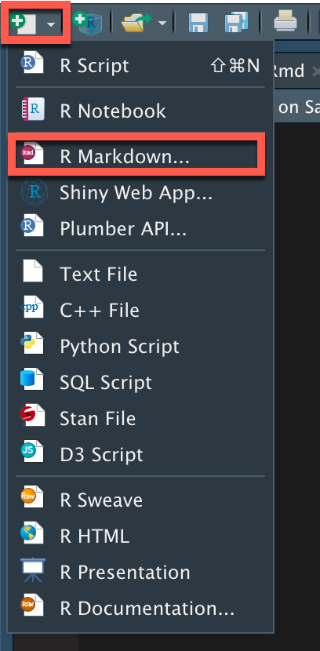
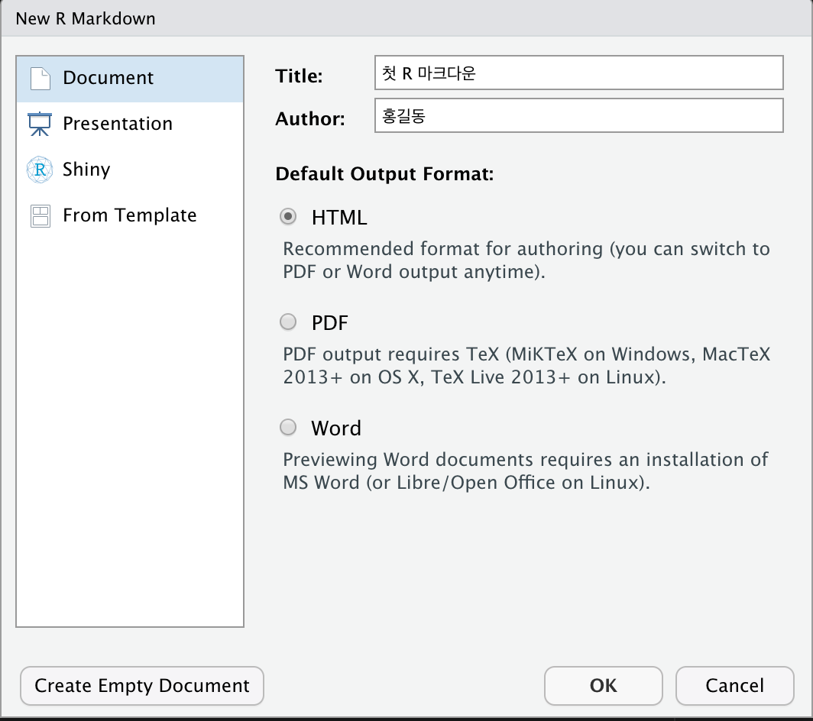
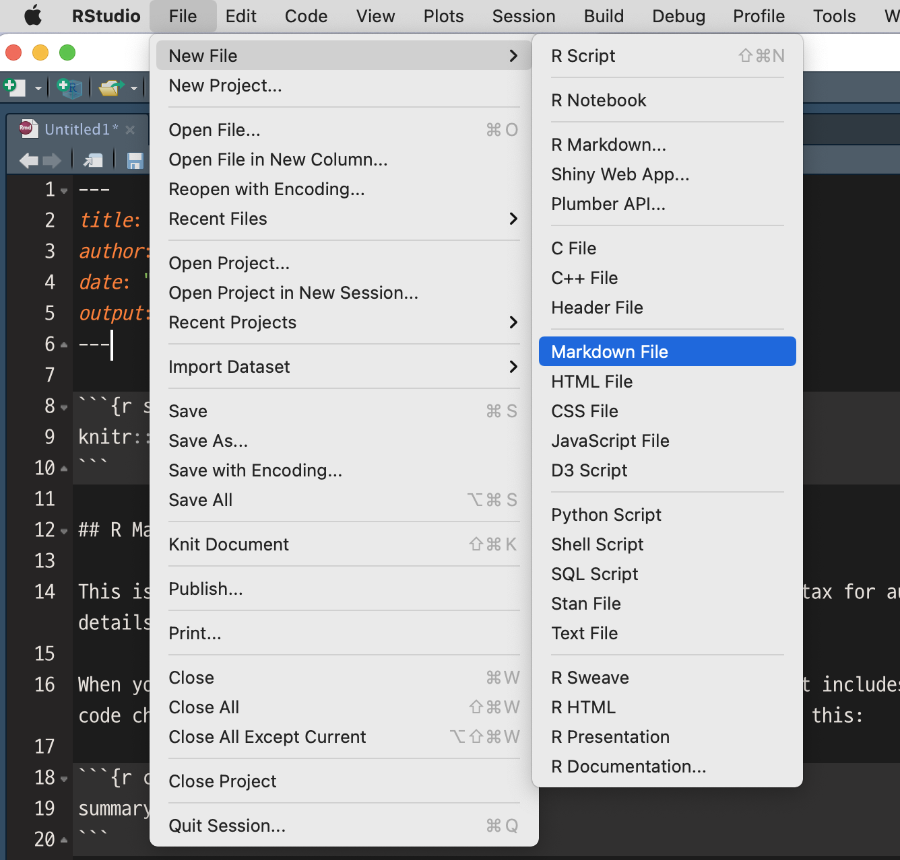
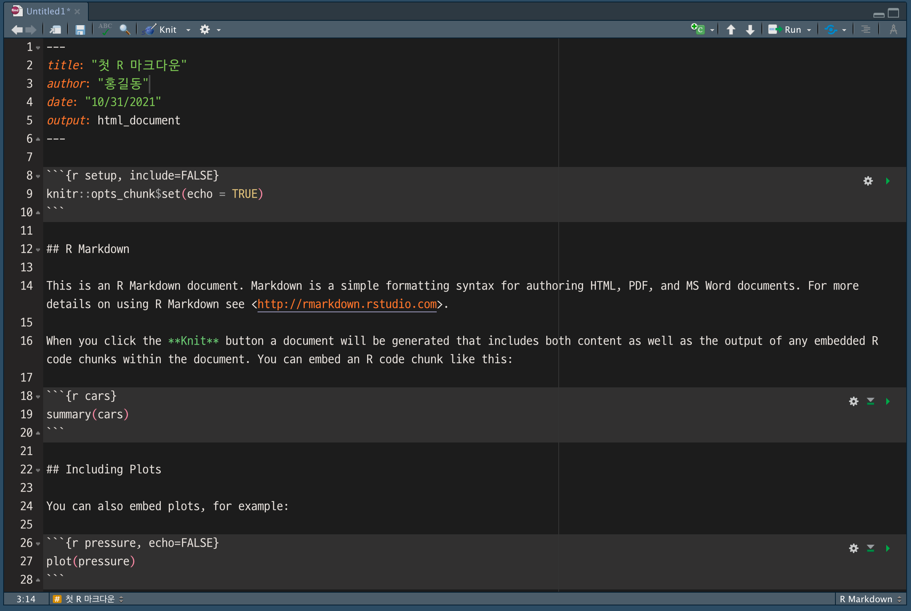
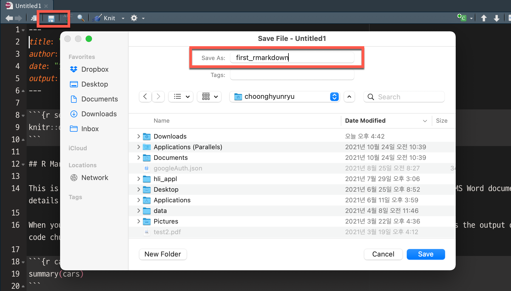
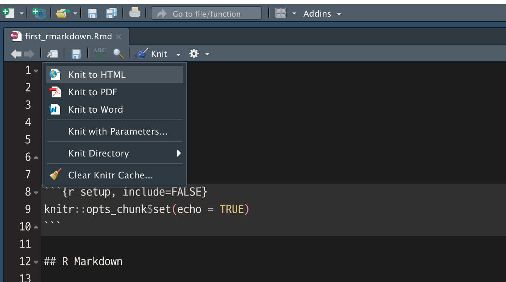
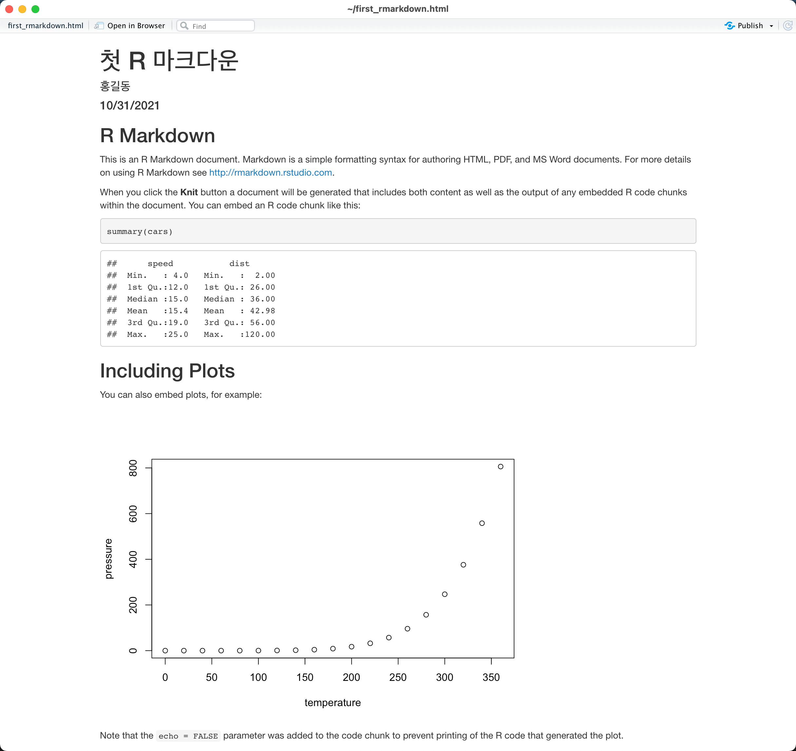

```{r setup, include=FALSE}
knitr::opts_chunk$set(echo = TRUE, 
                      message = FALSE, 
                      warning = FALSE, 
                      collapse = FALSE,
                      fig.align = "center")
knitr::opts_chunk$set(fig.width = 12, fig.height = 9)

library(shiny)
library(htmltools)

xaringanExtra :: use_panelset()
```

```{r tidyverse, echo=FALSE, out.width = "45%"}
knitr::include_graphics("img/rstudio.png")
```

```{r, preface, echo=FALSE}
div(class = "preface", 
    h4("들어가기"),
    "RStudio를 제대로 사용하는 것은 R 마크다운을 사용할 줄 안다는 것입니다.", br(),
    "RStudio는 재현가능한 연구를 위한 최적의 솔루션이기 때문입니다. 이제 여러분은 RStudio를 제대로 사용할 수 있게 됩니다.", br(),
    "운영체제에 따라 화면 모습에 다소 차이가 있을 수 있습니다. 염두에 두시기 바랍니다.")
```

## R 마크다운 문서 만들기
R 마크다운 문서를 생성하는 방법을 학습합니다. 지시에 따라 R 마크다운 파일을 생성합니다. 

### R 마크다운 문서 만들기

1. RStudio에서 R 마크다운 문서를 만들어 보겠습니다. RStudio의 좌측 상단의 새로운 파일 생성 아이콘을 누른 후, 메뉴에서 "R Markdown..."을 선택합니다. 

{width=30% height=100%}

2. New R Markdown 다이얼로그에서 다음을 입력하고 'OK' 버튼을 누르세요.

* 제목에 '첫 R 마크다운'을 입력합니다.
* 저자에 당신의 이름을 입력합니다. 예시에는 '홍길동'을 입력했습니다.
* 출력 포맷에서 HTML을 선택합니다. 기본값입니다.
* 'OK' 버튼을 눌러, R 마크다운 문서를 생성하세요.

{width=70% height=100%}

다이얼로그의 왼쪽 헤더에는 R 마크다운의 종류를 선택할 수 있는 메뉴가 있습니다. 메뉴를 선택하면, 오른쪽에 해당 메뉴에 따라 R 마크다운 파일을 생성하는 옵션들이 나타납니다.

* Document
    + 정적 문서(static documents)를 생성하기 위한 메뉴입니다.
    + HTML, PDF, 워드 파일을 생성할 수 있습니다.
* Presentation
    + 발표 슬라이드를 생성하기 위한 메뉴입니다.
    + HTML, PDF, 파워포인트 파일의 슬라이드를 생성할 수 있습니다.
* Shiny
    + Shiny 기반의 동적 문서(dynamic documents)를 생성하기 위한 메뉴입니다.
    + Shiny 웹앱이나 Shiny 슬라이드를 생성합니다.
* Form Template
    + 특정 목적을 위해서 미리 준비한 R 마크다운 문서 템플리트를 사용하는 메뉴입이다. 
    + 관련 템플리트를 지원하는 R 패키지가 설치되어야 합니다. 


```{r, sol-1, echo=FALSE}
div(class = "bg-blue", 
    h4(icon("lightbulb", style = "margin-right: 5px;"), 
       "솔루션", style = "margin-bottom: 10px; margin-top: 0px;"), 
    "New R Markdown 다이얼로그를 여는 방법은 두가지입니다. 튜토리얼에서 제시하는 메뉴 아이콘 선택 방법과 \"File > New File > Markdown File\" 메뉴를 이용하는 방법입니다. 메뉴 아이콘 이용 방법이 간결하고 쉽습니다.")
```

{width=60% height=100%}

3. 생성된 R 마크다운 템플리트 문서를 살펴보세요.

* 제목과 당신의 이름은 어느 위치에 표현되어 있습니까?
* 'output:'은 어떻게 기술되어 있습니까?
* 어떤 내용의 문서를 생성할 것이지를 이야기해 보세요.
    + 두 개의 R 코드 청크를 해석해 보세요.
    + 'pressure' 청크는 어떤 플롯을 그리는 것일까요?
* R 마크다운 문서의 이름이 'Untitled1'인 것을 확인하세요.
    + 아직은 파일로 저장되지 않은 상태입니다.


{width=100% height=100%}

### R 마크다운 문서 저장하기

4. 생성된 R 마크다운 파일의 이름이 정해지지 않았음을 발견했습니다.

* 좌측 상단의 디스켓 모양의 아이콘을 눌러 파일을 저장하세요. 
    + 파일 이름에 'first_rmarkdown'을 입력하세요.
    + 'Save' 버튼을 눌러 파일을 저장하세요. 

{width=90% height=100%}


## HTML 생성하기
RStduio는 knitr을 이용해서 R 마크다운 문서를 마크다운 문서로 변환합니다. 그래서 메뉴에 **'knit'**라고 표현하는 것은 지정한 포맷의 보고서 파일을 생성하라는 의미입니다.  

마크다운 문서로 최종 보고서 파일을 생성하는 방법을 학습합니다. 지시에 따라 보고서 파일을 생성합니다. 

### 보고서 파일 생성하기

5. 좌측 상단의 뜨개실 이미지 아이콘을 눌러 보고서 파일을 생성하세요.

* 뜨개실 이미지 아이콘 옆에 'Knit'라는 문자열과 역삼각형 이미지를 확인하세요.
* 'Knit'라는 문자열과 역삼각형 이미지를 클릭하세요.
    + **주의) 역삼각형 이미지가 아닌 'Knit' 문자열을 클릭하면 메뉴의 팝업없이 바로 실행됩니다.**
* 팝업된 메뉴에서 'Knit to HTML'을 눌러 보고서 파일을 생성합니다.

{width=90% height=100%}

팝업 메뉴에는 최종 파일의 포맷을 선택하는 기능, 파라미터를 추가하는 메뉴 등이 포함되어 있습니다.

* Knit to HTML
    + HTML 문서를 생성합니다.
* Knit to PDF
    + PDF 문서를 생성합니다.
* Knit to Word
    + 워드 문서를 생성합니다.    
* Knit with Parameters... 
    + R 마크다운 문서에 입력 파라미터를 설정했을 경우, 파라미터의 값을 정의합니다.
* Knit Directory
    + 생성한 최종 보고서를 저장할 경로를 설정합니다.
    + Document Directory
        + R 마크다운 파일이 있는 디렉토리에 저장합니다.
        + 기본값입니다.
    + Project Directory
        + R 프로젝트 안에서의 R 마크다운 파일일 경우, 프로젝트 루트에 저장합니다.   
    + Current Working Directory        
        + 현재 R 작업 경로에 저장합니다.    
        
        
### 보고서 파일 살펴보기

6. 브라우저에 출력된 HTML 문서를 확인하세요.

* 제목과 저장 이름이 출력된 위치와 크기를 확인하세요.
* R 코드 청그 위치에 어떤 내용이 표시되어 있습니까?
    + HTML 본문의 <https://rmarkdown.rstudio.com>{target="_blank"}을 눌러보세요.

{width=100% height=100%}

## 요약 
### 핸즈온 요약

* R 마크다운 문서를 생성했습니다.
* R 마크다운 문서로 HTML 문서를 생성했습니다.

### I can do it

* RStudio의 메뉴를 이용해서 R 마크다운 문서를 작성하고, R 마크다운 문서의 R 코드 청크를 실행하여 HTML 문서를 생성할 수 있습니다.


