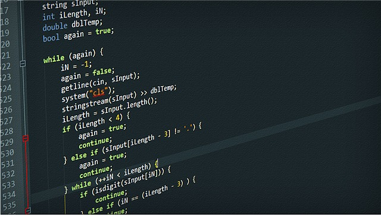

```{r setup, include=FALSE}
knitr::opts_chunk$set(echo = TRUE, 
                      message = FALSE, 
                      warning = FALSE, 
                      collapse = FALSE,
                      fig.align = "center")
library(shiny)
library(htmltools)

xaringanExtra::use_panelset()
```

```{r naver, echo=FALSE, out.width = "50%"}

```

```{r, preface, echo=FALSE}
div(class = "preface", 
    h4("들어가기"),
    "혼자면 충분합니다.", br(),
    "둘이면 어쩌면 필요합니다.", br(),
    "셋 이상이면 필수입니다. 뭐냐구요? 협업을 위해서 필요한 R 코딩 스타일 가이드입니다.")
```


## R 코딩 스타일

혼자서 패키지를 개발할 경우에는 문제가 덜하지만, 여럿이 협업해서 패키지를 개발할 경우에는 R 코딩 스타일이 이슈가 될 수 있습니다. 
사람마다 서로 다른 코딩 스타일을 사용할 경우에는 코드의 일관성이 결여되고 협업에 어려움이 따르게 됩니다. 이 경우에는 서로 합일한 R 코딩 스타일 규칙을 따르는 것이 필요합니다. 굳이 협업이 아니더라도 잘 정의된 코딩 스타일을 고수할 필요 있습니다.

> Good coding style is like using correct punctuation. You can manage without it, but it sure makes things easier to read. -- Hadley Wickham

R 코딩 스타일은, 아주 오랜 전에 나온 [Google의 R 스타일](https://google.github.io/styleguide/Rguide.xml){target="_blank"}도 있지만, [**The tidyverse style guide**](https://style.tidyverse.org/){target="_blank"}를 준수하는 것을 권장합니다.


## 중요한 R 코딩 스타일

The tidyverse style guide에 기술된 대표적인 코딩 스타일 컨벤션

|   구분     |     규약                             |      Good                      |  Bad                    |
|:-----------|:-------------------------------------|:-------------------------------|:------------------------|
| 객체 이름  | 소문자로 정의                        | day_one, day_1                 | DayOne, dayone          |
| 객체 이름  | 예약어나, 기정의 이름 불가           |                                | T, mean                 | 
| 공백       | 컴마 뒤에 공백문자                   | x[, 1]                         | x[,1], x[  ,1]          |
|            | 함수 호출 괄호 앞뒤에 공백문자 불가  | mean(x, na.rm = TRUE)          | mean (x, na.rm = TRUE)  |
|            |                                      |                                | mean( x, na.rm = TRUE ) |
|            | 괄호 뒤에 공백문자                   | function(x) {}                 | function (x) {}         |
|            |                                      |                                | function(x){}           |
|            | **연산자 앞 뒤에 공백문자**          | height <- (feet * 12) + inches | height<-feet*12+inches  |
|            |                                      | mean(x, na.rm = TRUE)          | mean(x, na.rm=TRUE)     |
|            | **연산자 앞 뒤에 공백문자 불가**     | sqrt(x^2 + y^2)                | sqrt(x ^ 2 + y ^ 2)     |
|            |                                      | df$z                           | df $ z                  |
|            |                                      | x <- 1:10                      | x <- 1 : 10             |


## 기타 중요한 규약

### 객체 이름
객체의 이름은 영문과 숫자, 그리고 문자 "_"으로 정의합니다. 그리고, **간결하지만, 의미를 충분히 전달해야 합니다**.

* 변수는 명사를 사용하고,
    + 예) item, score
* 함수는 동사를 사용하고
    + 예) edit_table, print

### 중괄호 내에서는 항상 들여 쓰기 

```{r, eval=FALSE, echo=TRUE}
# Good
if (y < 0 && debug) {
  message("y is negative")
}

# Bad
if (y < 0 && debug) {
message("Y is negative")
}
```

### 코드의 라인 길이는 80자 이내 
코드의 라인 길이는 80자 이내로 관리합니다. Rstudio의 Global Options... > Code > Display 메뉴에서 `Show margin`을 체크하면, 에디터에 기준선이 80자를 표현해서 80자 이내로 관리하는데 유용합니다.

```{r margin, fig.align='center', fig.pos='h', echo=FALSE, out.width = '70%'}
knitr::include_graphics('./img/margin.png', dpi = 300)
```

### 코드 들여쓰기(indentation)은 공백 2자로, 탭을 사용하지 않는다.
코드의 들여쓰기는 공백 2로 설정합니다. Rstudio의 Global Options... > Code > Edit 메뉴에서 `Insert spaces for tab`을 체크한 후, 탭을 공백 2개로 설정하면 유용합니다. 공백의 개수는 2개, 4개 등 호불호가 있기는 합니다만 개인적으로 2개를 추천합니다.

```{r tab, fig.align='center', fig.pos='h', echo=FALSE, out.width = '70%'}
knitr::include_graphics('./img/tab.png', dpi = 300)
```

### 할당 연산자의 선택
* 이름에 객체를 할당할 때에는 `<-` 연산자를 사용
    + 예) average <- mean(x, na.rm = TRUE)
* 함수에서 인수에 인수값을 할당할 때에는 `=`를 사용
    + 예) edit_table, print

### 주석의 생활화
주요 로직이나, 공유해야할 사항, 남겨야할 정보 등을 반드시 주석으로 남겨야 합니다. 


## 코딩 스타일 지원 패키지

이 장에서는 tidyverse R 코딩 스타일 가이드에 어느 정도 부합하는 몇 가지 R 패키지를 소개합니다. 그리고 이들 패키지로 사용자가 작성한 소스가 R 코딩 스타일에 부합하는지의 여부를 점검하거나, 패키지에서 추천하는 코딩 스타일로 소스를 변경해주는 방법을 알아봅니다.

> 이들 패키지가 100% 완전한 코딩 스타일을 준수하는 코드로 바꿔주거나 제언해주지 않음을 염두에 두어야 합니다.

### formatR
formatR 패키지는 R 코드의 포맷을 자동으로 바꿔주는 기능을 수행하는 패키지입니다. 
이 패키지를 사용하여 작성한 R 코드를 스타일 가이드에 의거하여 적절하게 바꿔주는 방법을 살펴봅니다.

예제는 패키지의 R 소스 코드를 담고 있는 "R" 디렉토리 내의 misc.R 파일에 `getMonthLenth()` 함수 정의 코드가 들어 있음을 가정합니다.

R/misc.R 파일의 getMonthLenth() 함수를 정의하는 코드는 다음과 같습니다.

```{r, eval=FALSE, echo=TRUE}
getMonthLenth <- function(startYear, startMonth, endYear, endMonth) {
    ifelse(startMonth > endMonth,
         12 + endMonth - startMonth + (endYear - startYear - 1) * 12 + 1,
         endMonth - startMonth + (endYear - startYear) * 12 + 1)
}
```

`formatR` 패키지의 `tidy_file()` 함수는 지정한 파일에 대해서 R 코드의 포맷을 자동으로 바꿔주고, `tidy_dir()` 함수는 지정한 디렉토리에 포함된 R 파일에 대해서 코드 포맷을 보정해 줍니다.

다음은 패키지의 R 소스 코드에 대해서 포맷을 보정해 주는 명령어입니다. 

```{r, eval=FALSE, echo=TRUE}
> formatR::tidy_dir("R", indent = 2, width.cutoff = 60)
tidying R/misc.R
```

상기 코드가 실행되면 R/misc.R 파일의 getMonthLenth() 함수를 정의하는 코드는 다음과 같이 보정됩니다. `indent` 인수의 값이 2인것은 들여쓰기를 스페이스 2개로 지정한 것이고, `width.cutoff` 인수는 할 줄에 표현하는 코드의 길이를 60 character로 지정한다는 의미입니다.

```{r, eval=FALSE, echo=TRUE}
getMonthLenth <- function(startyear, startmonth, endyear, endmonth) {
  ifelse(startmonth > endmonth, 12 + endmonth - startmonth + 
    (endyear - startyear - 1) * 12 + 1, endmonth - startmonth + 
    (endyear - startyear) * 12 + 1)
}
```


### lintr
`lintr` 패키지는 R 코딩 스타일 부합 여부를 점검해줍니다. R 코드를 변경하지 않고 점검만 해주는 점이 `formatR` 패키지와의 차이점입니다. 그러나 `lintr` 패키지의 점검 내용은 포맷보다는 코딩 스타일에 가깝습니다. 예를 들면 변수의 이름은 소문자로 사용하는 것, 할당 연산자를 `=` 대신에 `<-`를 사용하는 것 등의 암묵적인 R 코딩 스타일의 준수 여부를 체크합니다.

`lint_file()` 함수는 지정하는 R 파일에 대해서 R 코딩 스타일의 준수 여부를 체크하고, `lint_package()` 함수는 패키지 내의 R 파일에 대해서 R 코딩 스타일의 준수 여부를 체크합니다.

다음은 패키지의 R 소스 코드에 대해서 R 코딩 스타일의 준수 여부를 체크합니다. RStudio 상에서의 결과는 아래의 그림처럼 Markers 탭에 표현되며, 체크에서 미준수 항목으로 출력된 개별 라인을 클릭하면, 소스 파일의 해당 위치로 커서가 옮겨집니다.

```{r, eval=FALSE, echo=TRUE}
> lintr::lint_package()
```

```{r lint, fig.align='center', fig.pos='h', echo=FALSE, out.width = '100%'}
knitr::include_graphics('./img/lint.png', dpi = 300)
```

체크에서 미준수 항목으로 출력된 개별 라인을 수정한 후 `lint_package()` 함수를 재 실행하면서 코드를 수정하면 R 코딩 스타일에 부합하는 코드를 작성할 수 있습니다.

미준수 항목으로 출력된 개별 라인을 수정하여, `getMonthLenth()` 함수를 다음과 같이 재작성하였습니다.

```{r, eval=FALSE, echo=TRUE}
get_month_length <- function(startyear, startmonth, endyear, endmonth) {
  ifelse(startmonth > endmonth, 12 + endmonth - startmonth +
    (endyear - startyear - 1) * 12 + 1, endmonth - startmonth +
    (endyear - startyear) * 12 + 1)
}
```
