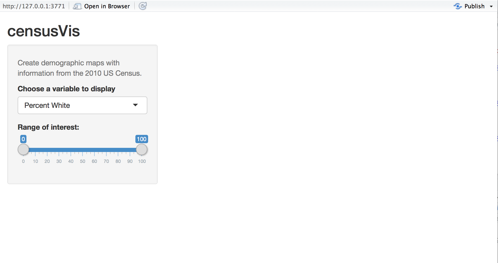
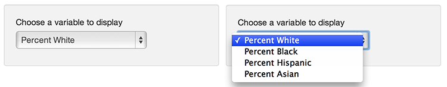

```{r setup, include=FALSE}
knitr::opts_chunk$set(echo = FALSE, 
                      message = FALSE, 
                      warning = FALSE, 
                      collapse = FALSE,
                      fig.align = "center")

library(shiny)
library(htmltools)
```

```{r user-interface, echo=FALSE, out.width = "20%"}
knitr::include_graphics("img/Widget_icon.png")
```

```{r, preface}
div(class = "preface", 
    h3("들어가기"),
    "위젯은", strong("메신저의 눈과 귀"), "입니다.", strong("의도 파악을 위한 듣는 위젯"), "과", strong("내용의 전달을 위한 말하는 위젯"), "으로 구성됩니다.", br(),
    "위젯의 기능과 사용방법을 익히는 것은 말을 익히는 것과 유사합니다. 당신은 문법을 익히고, 어휘를 늘려가야 합니다. 관용어구를 하나 더 익혀야할 수도 있습니다.",
    style = "margin-bottom: 40px;")
```

# 위젯을 아시나요?
     
"위젯(widget)은 컴퓨터 프로그래밍에서 위젯(widget) 또는 컨트롤(control)은 컴퓨터 사용자가 상호 작용하는 인터페이스 요소입니다." - https://ko.wikipedia.org/wiki/GUI_위젯 중에서

## 입력 위젯
Shiny에서는 입력 위젯을 컨트롯 위젯(control widgets)이라 부릅니다. 즉, 위젯을 통해서 앱을 컨트롤하기 때문입니다. 굳이 입력 위젯이라고 불렀던 것은 입력된 값을 통해서 기능이 컨트롤되고, 중요한 대부분 컨트롤 위젯 이름의 접미사가 "Input"이기 때문입니다.

shiny 패키지의 입력 위젯은 버튼을 포함해서 다음과 같은 종류가 있습니다.

```{r, echo=TRUE}
library(shiny)

setdiff(union(ls(pos = "package:shiny", pattern = "Input$"), 
      ls(pos = "package:shiny", pattern = "Button$")),
      ls(pos = "package:shiny", pattern = "^update"))
```

기본 입력 위젯은 다음 그림과 같습니다.


# 위젯을 추가한 예제

다음 예제는 레이아웃과 패널에 입력 위젯을 출력한 예제입니다. 

```{r, echo=TRUE, eval=FALSE}
ui <- fluidPage(
  titlePanel("censusVis"),
  
  sidebarLayout(
    sidebarPanel(
      helpText("Create demographic maps with 
               information from the 2010 US Census."),
      
      selectInput("var", 
                  label = "Choose a variable to display",
                  choices = list("Percent White", 
                                 "Percent Black",
                                 "Percent Hispanic", 
                                 "Percent Asian"),
                  selected = "Percent White"),
      
      sliderInput("range", 
                  label = "Range of interest:",
                  min = 0, max = 100, value = c(0, 100))
    ),
    
    mainPanel()
  )
)
```

위의 예제의 결과는 다음과 같습니다.



그리고 위 그림에서 selectInput은 이름처럼 여러 값 중에서 하나의 값을 선택하는 입력 위젯입니다. 다음처럼 마우스를 올려 놓으면 네 개의 값이 출력되고, 사용자는 하나의 값을 선택하면 됩니다.




# tutorial
     
## 입력 위젯 완성하기 tutorial

다음 코드를 입력한 후, app.R이라는 이름의 파일로 저장하고 실행해 보세요. 완성된 입력 위젯의 기능을 확인할 수 있습니다. 
여러분은 UI 파트를 완성하였습니다.

```{r, eval=FALSE, echo=TRUE}
library(shiny)

# Define UI ----
ui <- fluidPage(
  titlePanel("censusVis"),
  
  sidebarLayout(
    sidebarPanel(
      helpText("Create demographic maps with 
               information from the 2010 US Census."),
      
      selectInput("var", 
                  label = "Choose a variable to display",
                  choices = list("Percent White", 
                                 "Percent Black",
                                 "Percent Hispanic", 
                                 "Percent Asian"),
                  selected = "Percent White"),
      
      sliderInput("range", 
                  label = "Range of interest:",
                  min = 0, max = 100, value = c(0, 100))
    ),
    
    mainPanel()
  )
)

# Define server logic ----
server <- function(input, output) {
  
}

# Run the app ----
shinyApp(ui = ui, server = server)
```

## Shiny 공식 tutorial 페이지

Shiny 공식 tutorial 페이지를 살펴보고, 입력 위젯의 종류와 설정하는 방법을 이해하세요.

[https://shiny.rstudio.com/tutorial/written-tutorial/lesson3/](https://shiny.rstudio.com/tutorial/written-tutorial/lesson3/){target="_blank"} 


## 추가 예제 실행해 보기

예제를 실행시켜 보고, 다양한 입력 위젯과 출력 위젯을 경험해 보세요.

```{r, eval=FALSE, echo=TRUE}
shiny::runExample("07_widgets")
```


