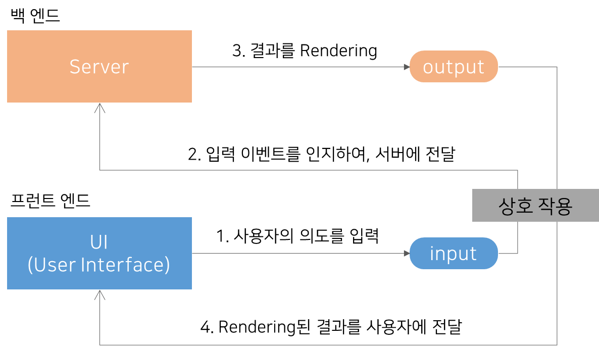
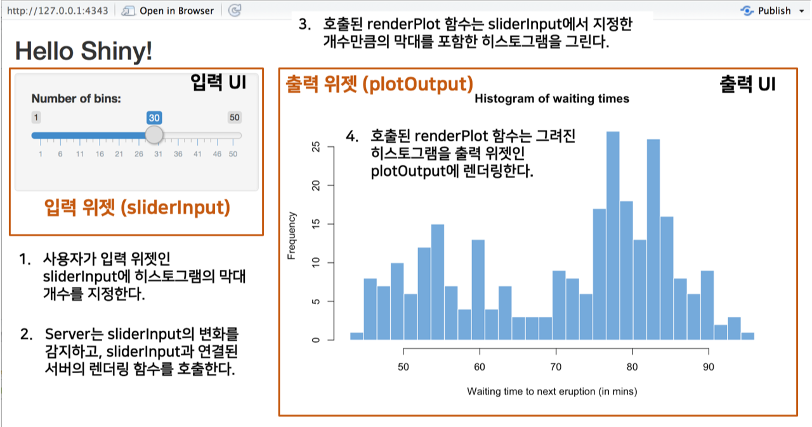

```{r setup, include=FALSE}
knitr::opts_chunk$set(echo = FALSE, 
                      message = FALSE, 
                      warning = FALSE, 
                      collapse = FALSE,
                      fig.align = "center")

library(shiny)
library(htmltools)
```

```{r shiny, echo=FALSE, out.width = "20%"}
knitr::include_graphics("img/shiny.png")
```

```{r, preface}
div(class = "preface", 
    h3("들어가기"),
    "본 핸즈온(튜토리얼)은", strong("Shiny를 이해하려는 대상의 OJT를 염두로"), "작성되었습니다. 초심자 대상이기 때문에, Shiny의 ABC만   
     다룹니다. 그 이상의 학습을 원하는 분들은", strong("Resouces"), "페이지를 참고하십시요.", br(),
    "학습 내용은", strong("Shiny in seven lessons"), "(",
    a(href = "https://shiny.rstudio.com/tutorial/", target='_blank', "https://shiny.rstudio.com/tutorial/"), ") 을 참조하여 작성하였습니다.",
    style = "margin-bottom: 40px;")
```

# Shiny 아키텍처
     
## UI와 Server의 상호작용



* UI : 사용자 인터페이스(User Interface) 영역으로 **입력 위젯(input widget)을 통해 사용자가 의도하는  파라미터(인수)를 server에 전달**합니다.
* server : **입력 위젯의 변화를 감지**하여, 미리 정의된 작업을 수행한 후 그 **결과를 출력 위젯(output widget)에 렌더링하여(rendering)** 사용자에게 전달합니다.


## UI와 server의 상호작용 예시



* sliderInput 위젯은 사용자 입력을 기다리고,
    + 입력 위젯(input widget)은 사용자의 입력을 대기
* 입력을 인지한 후, sliderInput 위젯과 연결된 renderPlot() 함수를 호출 
    + 위젯이 변경되면 변경된 위젯이 포함된 렌더링 함수가 자동 호출됩니다. 
* renderPlot() 함수는 sliderInput 위젯 값만큼의 막대가 포함된 히스토그램을 그리고,
    + 렌더링 함수가 실행됩니다. 
* 히스토그램은 출력 위젯(Output widget)인 plotOutput에 렌더링(그려짐)됩니다.
    + 출력 위젯에 렌더링된 결과가 반영됩니다.    
    
    
## UI와 server의 상호작용 표준화
UI와 server의 상호작용을 shiny 스크립트 관점에서 표준화해 봅니다.

1. 위젯들은 개별 위젯을 인식하도록 아이디를 부여해야 합니다.
    + 입력 위젯은 inputId,
    + 출력 위젯은 outputId
2. 입력 위젯의 이름은 **"기능명 + Input"** 포맷으로 정의됩니다.
    + sliderInput  = slider + **Input**,
    + 즉, 슬라이더로 사용자 **입력**을 받아서 서버로 전달하는 위젯
3. 출력 위젯의 이름은 **"기능명 + Output"** 포맷으로 정의됩니다.
    + plotOutput  = plot + **Output**,
    + 즉, 시각화된 R 플롯을 **출력**하는 위젯
4. 렌더링 함수 이름은 **"render + 기능명"** 포맷으로 정의됩니다.
    + renderPlot = **render** + Plot,
    + 즉, 플롯으로 렌더링하는(플롯을 그리는) 함수


# Shiny 첫 예제
     
## 히스토그램 그리기 예제

UI와 Server의 상호작용 예시를 구현한 shiny 프로그램은 다음과 같습니다.

눈으로 한번 쭉 훑어보세요. 이해할 것 같으면서도 어려운 겁니다. 

```{r, eval=FALSE, echo=TRUE}
library(shiny)

# Define UI for application that draws a histogram
ui <- fluidPage(

    # Application title
    titlePanel("Old Faithful Geyser Data"),

    # Sidebar with a slider input for number of bins 
    sidebarLayout(
        sidebarPanel(
            sliderInput("bins",
                        "Number of bins:",
                        min = 1,
                        max = 50,
                        value = 30)
        ),

        # Show a plot of the generated distribution
        mainPanel(
           plotOutput("distPlot")
        )
    )
)

# Define server logic required to draw a histogram
server <- function(input, output) {

    output$distPlot <- renderPlot({
        # generate bins based on input$bins from ui.R
        x    <- faithful[, 2]
        bins <- seq(min(x), max(x), length.out = input$bins + 1)

        # draw the histogram with the specified number of bins
        hist(x, breaks = bins, col = 'darkgray', border = 'white')
    })
}

# Run the application 
shinyApp(ui = ui, server = server)
```

## 예제 실행해 보기
아키텍처를 이해하려는 목적으로 결과를 보고 프로그램도 살펴 보세요. 

```{r, eval=FALSE, echo=TRUE}
shiny::runExample("01_hello")
```

# tutorial

## Shiny 공식 tutorial 페이지

Shiny 공식 tutorial 페이지를 살펴보고, 앱을 실행시키는 방법을 숙지하세요.

[https://shiny.rstudio.com/tutorial/written-tutorial/lesson1/](https://shiny.rstudio.com/tutorial/written-tutorial/lesson1/){target="_blank"} 


