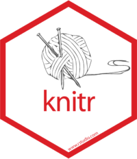
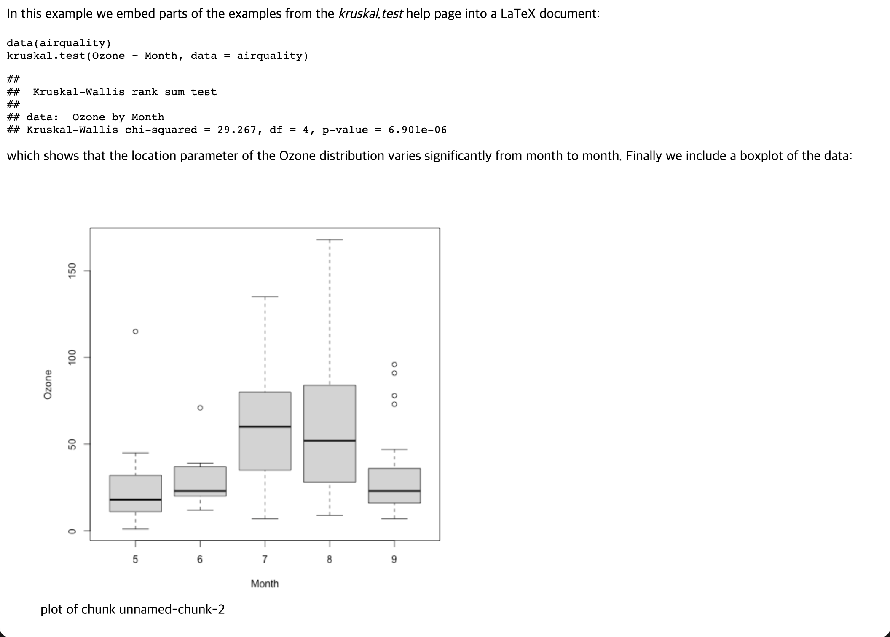
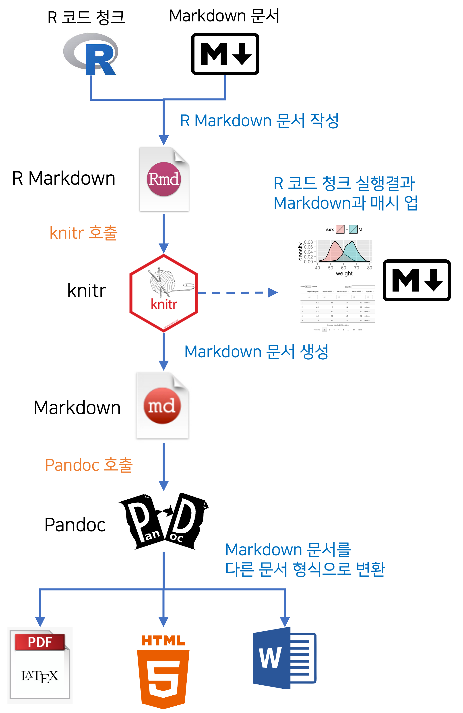

```{r setup, include=FALSE}
knitr::opts_chunk$set(echo = FALSE)
```

## 재현가능한 연구

**'재현가능한 연구'**(Reproducible Research)라는 용어가 생소할 수 있으나 R 세계에서는 제법 회자되는 용어로, **공개한 연구의 결과물이 재현되고 검증될 수 있도록 하는 것을 의미**합니다. 이 방법은 결국 연구가 발전하는 방향으로 재창조되는 결실을 가져옵니다. 이를 위해서는 데이터 분석의 방법을 실험 데이터에 연결하여 재현 검증될 수 있는 체계를 구축해야 합니다.

재현가능한 연구를 이해하기 쉬운 사례로 설명하겠습니다. 데이터 입출력 및 분석 로직과 분석 결과를 표현하는 R 스크립트를 **R 마크다운 문서**에 정리합니다. R 마크다운 문서에는 연구에 대한 자세한 설명과 결과 해석이 포함되어 있고, 별도의 공간에 파일로 저장된 원시 데이터도 경로를 통해 문서와 연결되어 있습니다. 이 R 마크다운 문서와 데이터 파일을 **RStudio 프로젝트**나 **R 패키지**에 포함하여 배포하면 누구나 동일한 결과를 재현할 수 있게 됩니다.

공개한 연구 자료에는 데이터, 분석을 위한 R 코드 및 과정의 설명과 결과의 해석 모두 포함되어야 합니다. 그러므로 재현가능한 연구는 공유의 가치를 인정하는 오픈소스 정신이 깃들여 있는 셈입니다.

[CRAN Task View: Reproducible Research](https://cran.r-project.org/web/views/ReproducibleResearch.html){target="_blank"}에는 재현가능한 연구를 지원하는 여러 R 패키지를 소개하고 있습니다. 페이지에 방문하면 아마 많은 패키지와 다양한 기능의 소개에 놀랄 것입니다. 또한 방대한 기능에 무엇인 재현가능한 연구인지 이해하기 어려울 수 있습니다. 

이 글에서는 R 패키지가 지원하는 여러 기능 중에서 다음 두 가지 사례를 통해서 재현가능한 연구를 소개하겠습니다.

* LaTeX에 포함된 R 코드를 수행하여 PDF 문서를 만드는 사례와 관련 리소스
* R 마크다운 문서로 분석 결과가 포함된 HTML 보고서를 만드는 방법과 관련 리소스


## 마크업 언어
여러분은 웹 브라우저에 표현되는 컨텐츠(웹 페이지나 웹 어플리케이션)는 HTML로 구현된다는 것은 알고 계실겁니다.
그런데 HTML은 "Hyper Text Markup Langaue"의 약자라는 것은 아시나요? 그리고 영어의 정확한 의미를 아시나요?

**'Text'**(텍스트)는 의미의 전달을 목적으로, 알파벳, 한글, 숫자, 기호 등의 문자 세트로 문서나 글을 표현한 것입니다. 우리는 **텍스트를 순차적으로 읽으면서 전달하는 의미를 이해**하게 됩니다. 

**'Hyper Text'**(하이퍼 텍스트)는 사전적으로 "텍스트를 뛰어넘는다"는 의미입니다. 웹 페이지는 본문에 다른 페이지로 이동하는 링크 기능을 이용해서 다른 페이지나, 페이지의 다른 영역으로 이동하는 링크 기능으로 페이지 내의 다른 문장의 영역으로 넘나들 수 있습니다. HTML에서는 이 링크를 **하이퍼 링크**(hyper link)라고 부릅니다. 즉, 하이퍼 링크를 통해서 **텍스트를 비순차적으로 읽으면서, 순차적 전달보다 의미를 좀 더 쉽게 이해**할 수 있습니다. 이것이 하이퍼 텍스트의 개념입니다.

통상적으로 **'텍스트 파일'**은 **서식이 없는 텍스트로 구성되어서, 어떤 에디터로도 쉽게 읽을 수 있는 파일을 의미**합니다. 
그러나 텍스트에 서식이 포함된 즉, 타이틀이나 주석, 볼드와 이탤릭처럼 폰트 페이스 등의 서식을 사용하거나 설명을 위해 이미지 삽화가 포함된 파일은 텍스트 에디터로는 읽을 수 없습니다. 별도의 프로그램으로만 열어볼 수 있습니다. HTML의 하이퍼 텍스트는 이러한 서식을 포함하고 있기 때문에 에디터가 아닌 웹 브라우저를 통해 읽어야 합니다.

**'Markup Langaue'**(마크업 언어)는 텍스트의 특정 위치에 표시를 하는 것을(마크업) 통해서 문서를 구조적으로 표현하는 컴퓨터 언어를 의미합니다. 물론 HTML에서의 구조적인 표현은 서식의 표현이나 페이지 간의 이동이나 페이지 내에서의 이동 등을 의미합니다.

**마크업 언어**는 **태그(tag) 등을 이용해서 문서나 데이터의 구조를 설명**합니다. 즉 마크업이라는 작업에 태그를 이용하는 것입니다. 그래서 마크업 언어의 문법적 특징은 태그에 나타나게 됩니다.
 
몇개의 HTML 태그를 예시하면, 하이퍼 링크 태그인 \<a\>\</a\>는 하이퍼 링크를 정의하며, 이미지 태그인 \로 웹 페이지에 이미지를 삽입합니다.


### 마크다운
마크업 언어의 하나인 **마크다운**(Markdown)은 읽기 쉽고 쓰기 쉬운 양식을 작성하기 위해서 만들어졌습니다. 사용법이 매우 쉽기 때문에 빠르게 서식이 있는 문서를 만들 수 있습니다.

:::: {style="display:grid; grid-template-columns: 15% 85%; grid-row-gap: 80px; align-self:start"}

::: {style="margin-top: 25px"}

```{r tidyverse, echo=FALSE, out.width = "90%"}
knitr::include_graphics("img/markdown.png")
```

:::

::: {style="color:grey"}

"마크다운(Markdown)은 일반 텍스트 기반의 경량 마크업 언어입니다. 일반 텍스트로 서식이 있는 문서를 작성하는 데 사용되며, 일반 마크업 언어에 비해 문법이 쉽고 간단한 것이 특징입니다. HTML과 리치 텍스트(RTF)[^1] 등 서식 문서로 쉽게 변환되기 때문에 응용 소프트웨어와 함께 배포되는 README 파일이나 온라인 게시물 등에 많이 사용됩니다."[^2]

:::

::::

[^1]: https://ko.wikipedia.org/wiki/서식_있는_텍스트_포맷. 서식 있는 텍스트 포맷 또는 리치 텍스트 포맷(Rich Text Format, 줄여서 RTF)은 마이크로소프트사가 1987년에 개발한 규격인 사유의 문서 파일 형식이며 크로스 플랫폼 문서 교환을 위하여 만들어졌다.
[^2]: https://ko.wikipedia.org/wiki/마크다운 발췌


### LaTeX

저작을 위한 전문 시스템인 LaTeX(레이택)은 일반 R 사용자가 사용하기에는 다소 여렵지만 출력물의 퀄리티가 높아서 선호되기도 합니다.

:::: {style="display:grid; grid-template-columns: 15% 85%; grid-row-gap: 80px; align-self:start"}

::: {style="margin-top: 10px"}

```{r latex_logo, echo=FALSE, out.width = "90%"}
knitr::include_graphics("img/latex_logo.png")
```

:::

::: {style="color:grey; margin-top: 10px;"}

LaTeX(레이택)은 논문이나 출판물 등의 문서를 작성하는 데 쓰이는 전문 조판 시스템입니다. LaTeX은 수식과 다이어그램을 많이 사용하고, 도표와 이미지 삽입이 빈번한 이공계열에서 논문을 작성에 사용하고 있습니다. 또한 서적 등을 출판하는 출판업계에서도 사용하고 있습니다. 

:::

::::

### Pandoc
RStudio를 설치하면 Pandoc(판독)도 함께 설치됩니다. 그 이유는 RStudio 기능에 재현가능한 연구를 위한 여러 문서 작성 기능이 있는데, Pandoc이 약방의 감초처럼 사용되기 때문입니다.

:::: {style="display:grid; grid-template-columns: 15% 85%; grid-row-gap: 80px; align-self:start"}

::: {style="margin-top: 25px"}

```{r pandoc, echo=FALSE, out.width = "90%"}
knitr::include_graphics("img/pandoc.png")
```

:::

::: {style="color:grey; margin-top: 10px;"}

"Pandoc은 마크업 형식을 다른 마크업 형식으로 변환해주는 라이브러리입니다. Pandoc은 Markdown, HTML, LaTeX 및 Word docx 등 수많은 마크업과 워드 프로세싱 형식 간에 변환을 수행합니다."[^3]

:::

::::

[^3]: https://pandoc.org/MANUAL.html 발췌


## Sweave 
R 재단의 멤버십 회원인 오스트리아의 Friedrich Leisch가 2002년에 만든, utils 패키지의 Sweave[@leisch_2002] 함수는 자동으로 리포트는 생성해 주는 함수입니다.

Sweave는 S를 이용한 데이터 분석과 LaTeX 조판을 통합하여 데이터 분석 보고서를 작성합니다. S는 상용 S+와 오픈소스 R을 의미합니다. 아마 요즘에 개발되었다면 함수 이름을 Rweave로 작명했을 것입니다. 왜냐하면 2000년대 초반에는 R보다는 S+의 명성이 더 컸기 때문입니다.

Sweave라는 이름은 "S" 와 "Weave"를 결합한 복합어입이다. 그러므로 이 함수는 "에스 위브"라 읽어야 합니다. "Weave"는 날실(직물의 길이 방향, 즉 세로로 놓인 실)과 씨실(직물의 너비 방향, 즉 가로로 놓인 실)로 직물을 짜는 것을 의미하는 동사입니다. 즉 직물을 짜듯, S(S+와 R)의 코드를 LaTeX 조판 코드와 잘 결합하여 완성된 데이터 분석 보고서(직물)를 생성한다는 의미입니다.   

정리하자면, Sweave는 R 코드의 실행 결과(데이터 분석의 출력 정보, 표, 그래프 등)를 LaTeX 파일에 자동 삽입합니다. 그리고 이 LaTeX 파일로 PDF을 조판하여 최종 보고서를 생성하는 것입니다.

Sweave의 단점은 LaTeX과 결합하여 PDF 파일만 생성한다는 점입니다. 2000년대 초반에는 S 사용자의 많은 수가 LaTeX을 사용할 수 있는 통계학자였고, 학술지 등에 LaTeX으로 만들어진 논문을 투고해야 했기에 이 조합은 매우 유용하였습니다. 그러나 최근의 데이터 과학 필드에서는 HTML 기반으로 보고서를 작성하는 경우가 많기 때문에, HTML을 포함한 다양한 포맷의 보고서를 생성할 수 없다는 것은 단점일 수 밖에 없습니다.


### Sweave 매커니즘
S 코드 청크(Chunk, 덩어리)는 특정 작업을 수행하는 S 스크립트(이하 R 스크립트로 표현합니다)를 의미합니다. LaTeX으로 만들어진 날실 곧곧에 R 코드인 씨실을 넣기 위해서 코드 청크를 사용합니다.

LaTeX 파일에 삽입하는 코드 청크는 다음의 포맷을 따릅니다.

```{r, eval=FALSE, echo=TRUE}
<<Sweave 옵션 영역>>=
R 코드 삽입 영역
@    
```

Sweave는 LaTeX 파일을 읽어 '<<>>=' 과 '@' 사이의 R 코드를 실행한 후, 실행 결과를 해당 위치의 LaTeX 파일에 삽입합니다. '<<'과 '>>=' 사이에 기술할 수 있는 Sweave 옵션은 다양한 출력을 제어할 수 있습니다. 예를 들면 플롯의 크기를 조정하거나 출력 텍스트의 서식을 제어할 수 있습니다. 경우에 따라서 실행 결과와 함께 R 코드도 출력할 수도 있습니다.

R 코드의 실행 결과가 삽입된 LaTeX 파일은 LaTeX 시스템의 pdfLaTex이나 XeLaTeX 프로그램을 통해서 PDF 파일로 변환됩니다. Sweave 파일은 확장자로 "Rnw"를 사용해야 합니다. 그런데 이 확장자는 대소문자를 구별하지 않습니다만 관행적으로 첫 문자를 대문자로 표현합니다.

RStudio는 이 몇 단계 과정을 한번에 엮어 실행합니다. 그래서 바로 PDF 파일을 만들어줍니다. 


### Sweave 예제

Sweave[@leisch_2002]에 삽입된 짧은 예제 파일을 살펴보겠습니다. example-1.Rnw 파일의 LaTeX 스크립트 중간에 R 코드가 삽입된 코드 청크 영역을 주의깊게 살펴보십시요.

```{r, eval=FALSE, echo=TRUE}
\documentclass[a4paper]{article}

\begin{document}
In this example we embed parts of the examples from the
\texttt{kruskal.test} help page into a \LaTeX{} document:

<<>>=
data(airquality)
kruskal.test(Ozone  ̃ Month, data = airquality)
@
which shows that the location parameter of the Ozone
distribution varies significantly from month to month.
Finally we include a boxplot of the data:

\begin{center}
<<fig=TRUE,echo=FALSE>>=
boxplot(Ozone  ̃ Month, data = airquality)
@
\end{center}

\end{document}
```

<br>

Sweave 파일은 Sweave에 의해서 다음과 같은 완전한, example-1.tex이라는 이름의 LaTex 파일로 변환됩니다. 시각화 결과는 example-1-002.pdf 파일로 따로 저장되게 됩니다.

```{r, eval=FALSE, echo=TRUE}
\documentclass[a4paper]{article}

\usepackage{Sweave}
\begin{document}

In this example we embed parts of the examples from the
\texttt{kruskal.test} help page into a \LaTeX{} document:

\begin{Sinput}
> data(airquality)
> kruskal.test(Ozone ~ Month, data = airquality)
\end{Sinput}
\begin{Soutput}
      Kruskal-Wallis rank sum test
data: Ozone by Month
Kruskal-Wallis chi-squared = 29.2666, df = 4, p-value = 6.901e-06
\end{Soutput}
which shows that the location parameter of the Ozone
distribution varies significantly from month to month.
Finally we include a boxplot of the data:

\begin{center}
\includegraphics{example-1-002}
\end{center}

\end{document}
```

<br>

마지막으로 LaTeX 파일을 pdfLaTex으로 변환하면 다음과 같은 PDF 문서가 만들어집니다.


## knitr 패키지
2010년대부터 R 필드의 패러다임 전환이 시작됩니다. 데이터 과학(data science)이 발전하면서 기존 통계학자들의 기여가 많았던 R 개발 진영에 데이터 과학자, 데이터 엔지니어, 프로그램 개발자들이 대거 활동하기 시작하면서 R 분석의 변화를 맞습니다.

데이터 모델링 분야에서는 개별 함수들을 이용한 방법에서 Max Kuhn의 caret(2007) 패키지로, 데이터 시각화 분야에서는 R 그래픽 함수와 lattice 패키지에서 Hadley Wickham의 ggplot2(2007)로 진화합니다. 데이터 엔지니어링에서도 Hadley Wickham의 dplyr(2014)가 기존 데이터 프레임 연산을 대체합니다.

caret 패키지를 제외한 ggplot2, dplyr 패키지에 협업 가능한 유용한 패키지들이 에코 패키지로 결합하여 tidyverse 패키지군이 태동합니다. 이들은 RStudio라는 회사를 구심점으로 많은 유용한 패키지를 개발합니다. 특히 Hadley Wickham을 중심으로 많은 데이터 과학자와 데이터 엔지니어, 웹 개발자들이 두각을 나타냅니다.

재현가능한 연구 분야도 발전하게 됩니다. Sweave의 단점을 보완하고 여러 유용한 기능을 추가한 **knitr 패키지**가 2012년 Yihui Xie에 의해 개발됩니다. 이제 데이터 분석 결과를 LaTeX 시스템 기반의 PDF로 조판하는 시대를 넘어서 HTML 기반의 WEB 채널로 배포되고 공유하는 시대가 도래한 것입니다. 

:::: {style="display:grid; grid-template-columns: 15% 85%; grid-row-gap: 80px; align-self:start"}

::: {style="margin-top: 10px"}

```{r knitr, echo=FALSE, out.width = "90%"}

```

:::

::: {style="color:grey; margin-top: 10px;"}

"Sweave에서 영감받은 knitr 패키지는 다른 애드온 패키지를 하나의 패키지로 결합[^4]하여, R을 이용해서 동적으로 리포트를 생성하기 위해서 개발되었습니다."[^5] 
<br>
이제 재현 가능을 연구를 위한 보고서 작성이 PDF를 넘어 HTML로 확장되고, 그 성능도 향상되기 시작합니다.
:::

::::

[^4]: knitr ≈ Sweave + cacheSweave + pgfSweave + weaver + animation::saveLatex() + R2HTML::RweaveHTML() + highlight::HighlightWeaveLatex() + 0.2 * brew + 0.1 * SweaveListingUtils + more
[^5]: knitr 홈페이지 https://yihui.org/knitr/ 발췌

knitr도 "knit"와 "R"을 결합한 복합어입이다. 그래서 "니트 알"로 발음해야 합니다. "knit"는 스웨터와 같은 옷을 뜨게질하는 것을 의미합니다. Sweave의 "Weave"가 직물을 직조하는 것과 동일한 의미입니다. 패키지 이름을 작명하는 것에도 위트가 숨어 있습니다. 마크다운 문서 곳곳에 다른 색상의 R이라는 털실로 뜨게질해서 무늬가 있는 스웨터(보고서)를 만드는 역할을 표현한 것입니다.


### R 마크다운 파일
**'R 마크다운'**(R Markdwon) 파일은 재현 개능한 연구를 위해서, 마크다운 문서에 R 코드 청크를 삽입한 파일입니다. 확장자로 "Rmd"를 사용하는데, 확장자는 Sweave 파일처럼 대소문자를 구별하지 않습니다.


### knitr 매커니즘
knitr는 R 마크다운 파일의 R 코드 청크를 실행해서 그 결과를 마크다운 문서와 결합한 마크다운 파일을 생성합니다. 마크다운 파일의 확장자는 "md"입니다.

knitr의 R 코드 청크는 다음의 포맷을 따릅니다.


<div class="sourceCode" id="cb1"><pre class="sourceCode r">
<span id="cb1-1"><a href="#cb1-1" aria-hidden="true" tabindex="-1">```{r, knitr 옵션 영역}</span>
<span id="cb1-2"><a href="#cb1-2" aria-hidden="true" tabindex="-1"></a>R 코드 삽입 영역</span>
<span id="cb1-3"><a href="#cb1-3" aria-hidden="true" tabindex="-1"></a><span class="sc">```</span>    
</pre></div>

knitr는 R 마크다운 파일을 읽어 백틱(\`) 문자 세개로 구성된  '\`\`\`{r}' 과 '\`\`\`' 사이의 R 코드를 실행한 후, 실행 결과를 해당 위치의 파일에 삽입하여 마크다운 문서를 생성합니다. 옵션은 다양한 출력을 제어할 수 있습니다. 예를 들면 플롯과 출력 텍스트의 서식을 제어할 수 있는 것은 물론 결과를 캐싱해서, 다음 작업에는 연산을 수행하지 않고 결과를 캐시에서 가져올 수도 있습니다. 

Sweave가 Sweave 파일을 LaTeX 파일까지만 생성하고, pdfLaTeX 유틸리티가 LaTeX 파일을 PDF 파일로 변환하는 것처럼, knitr는 R 마크다운 파일을 마크다운 파일까지만 생성합니다. 그리고 pandoc이 마크다운 파일을 원하는 포맷의 문서 파일로 변환합니다. 
두 방법의 차이점은 pdfLaTeX가 PDF 파일만 생성하는 것에 반해서, pandoc은 PDF를 포함해서 HTML, 워드, 파워포인트 파일까지 다양한 파일을 생성합니다. 

**knitr는 Sweave 파일도 처리**할 수 있습니다. 이 경우는 knitr 패키지의 **Sweave2knitr 함수가 Sweave 파일을 R 마크다운로 변환한 다음에 작업**합니다. 그러나 호환성이 다소 떨어지고, kintr의 다양한 기능으로 Sweave이 아니라 knitr을 사용하는 것을 권장합니다.  


### knitr 예제
Sweave[@leisch_2002]에 삽입된 예제를 example-1.Rmd이라는 이름의 다음과 같은 R 마크다운 파일로 생성하였습니다.

<div class="sourceCode" id="cb1"><pre class="sourceCode r">
<span id="cb1-1"><a href="#cb1-2" aria-hidden="true" tabindex="-1"></a>In this example we embed parts of the examples from the</span>
<span id="cb1-2"><a href="#cb1-2" aria-hidden="true" tabindex="-1"></a>*kruskal.test* help page into a LaTeX document:</span>
<span id="cb1-d"><a href="#cb1-2" aria-hidden="true" tabindex="-1"></a></span>
<span id="cb1-3"><a href="#cb1-1" aria-hidden="true" tabindex="-1">```{r}</span>
<span id="cb1-4"><a href="#cb1-2" aria-hidden="true" tabindex="-1"></a>data(airquality)</span>
<span id="cb1-5"><a href="#cb1-2" aria-hidden="true" tabindex="-1"></a>kruskal.test(Ozone ~ Month, data = airquality)</span>
<span id="cb1-6"><a href="#cb1-3" aria-hidden="true" tabindex="-1"></a><span class="sc">```</span>
<span id="cb1-7"><a href="#cb1-2" aria-hidden="true" tabindex="-1"></a>which shows that the location parameter of the Ozone</span>
<span id="cb1-8"><a href="#cb1-2" aria-hidden="true" tabindex="-1"></a>distribution varies significantly from month to month.</span>
<span id="cb1-9"><a href="#cb1-2" aria-hidden="true" tabindex="-1"></a>Finally we include a boxplot of the data:</span>
<span id="cb1-0"><a href="#cb1-2" aria-hidden="true" tabindex="-1"></a></span>
<span id="cb1-a"><a href="#cb1-1" aria-hidden="true" tabindex="-1">```{r, echo=FALSE}</span>
<span id="cb1-b"><a href="#cb1-2" aria-hidden="true" tabindex="-1"></a>boxplot(Ozone ~ Month, data = airquality)</span>
<span id="cb1-c"><a href="#cb1-3" aria-hidden="true" tabindex="-1"></a><span class="sc">```</span>  
</pre></div>

<br>

그리고 knitr 패키지의 knit 함수를 이용해서 마크다운 파일로 변경합니다.

```{r, eval=FALSE, echo=TRUE}
library(knitr)

knit("example-1.Rmd")
```

생성된 마크다운 파일인 example-1.md는 다음과 같습니다.


knitr 패키지의 pandoc 함수는 Pandoc을 랩핑한 함수입니다. 다음 명령을 마크다운 문서를 HTML로 변환하는 R 스크립트입니다. 메시지를 보면 Pandoc이 호출되어 HTML을 생성함을 유추할 수 있습니다.

```{r, eval=FALSE, echo=TRUE}
pandoc("example-1.md", format = "html")
Executing: pandoc -t html -o 'example-1.html' 'example-1.md'
[1] "example-1.html"
```

생성된 HTML 파일인 example-1.html이 웹 브라우저에 표현된 내용은 다음과 같습니다.



> RStudio를 사용하면 이런 몇 단계의 작업을 메뉴 하나로 함축해 놓았기 때문에, 그냥 메뉴 아이콘을 눌러 작업할 수 있습니다. 그래서 단계적으로 함수를 호출하는 것을 모르는 R 사용자가 대부분입니다. 지극히 정상입니다. 다만 RStudio를 사용하지 않는 R 사용자는 단계적으로도 작업을 할 수 있도록, 함수를 호출하는 방법을 숙지해야 합니다.  

## rmarkdown 패키지

Sweave와 knitr는 문서에 삽입된 R 코드 청크를 실행하고 그 결과를 LaTeX이나 마크다운 문서에 삽입하는 작업을 수행합니다. 그러나 이 작업은 최종 문서를 만드는 작업의 일부입니다. R 마크다운 파일이 문서가 되기 위해서는 다음의 워크플로우를 거쳐야 합니다. 이 작업을 수행해 주는 것이 rmarkdown 패키지입니다.

```{r flow, echo=FALSE, out.width = "50%"}

```


:::: {style="display:grid; grid-template-columns: 15% 85%; grid-row-gap: 80px; align-self:start"}

::: {style="margin-top: 25px"}

```{r rmarkdown, echo=FALSE, out.width = "90%"}
knitr::include_graphics("img/rmarkdown.png")
```

:::

::: {style="color:grey; margin-top: 10px;"}

rmarkdown는 마크다운과 R 코드를 연동하여 **재현 가능한 문서를 작성**할 수 있는 R 패키지입니다. **마크다운의 마크업 태그는 파일에 저장된 코드를 실행한 결과와 매시업**되어 사용자가 의도한 저작 콘텐츠를 **고품질의 문서로 자동으로 생성**해 줍니다.
<br>
R Markdown 문서는 재현 가능하며 수십 가지의 정적 및 동적 출력 형식을 지원합니다.
:::

::::

R 마크다운은 보고서만 만드는 도구가 아닙니다. R 마크다운을 이용하면 다음 그림[^6]처럼 블로그와 같은 웹 페이지를 만들 수도 있으며, 서적도 출판할 수 있습니다. 


[^6]: https://www.williamrchase.com/slides/ggplot_intro.html#57

R 마크다운을 소개하는 이 웹 페이지도 rmarkdown 기반으로 만들었습니다. (정확히 말하자면 distill 패키지를 이용한 R 마크다운 파일의 웹 페이지 생성)

많은 문서들이 웹 페이지로 생산되고, 배포 공유되는 세상입니다. R 마크다운을 이용해서 재현 가능한 문서를 생산하는 것을 적극 추천합니다. 특히 RStudio는 R 마크다운을 생산하고 배포하는 기능을 쉽게 메뉴화했습니다. 어렵게 느끼지 말고, R 기반의 데이터 분석 경험을 적극 자산화하고 공유하시기 바랍니다.


