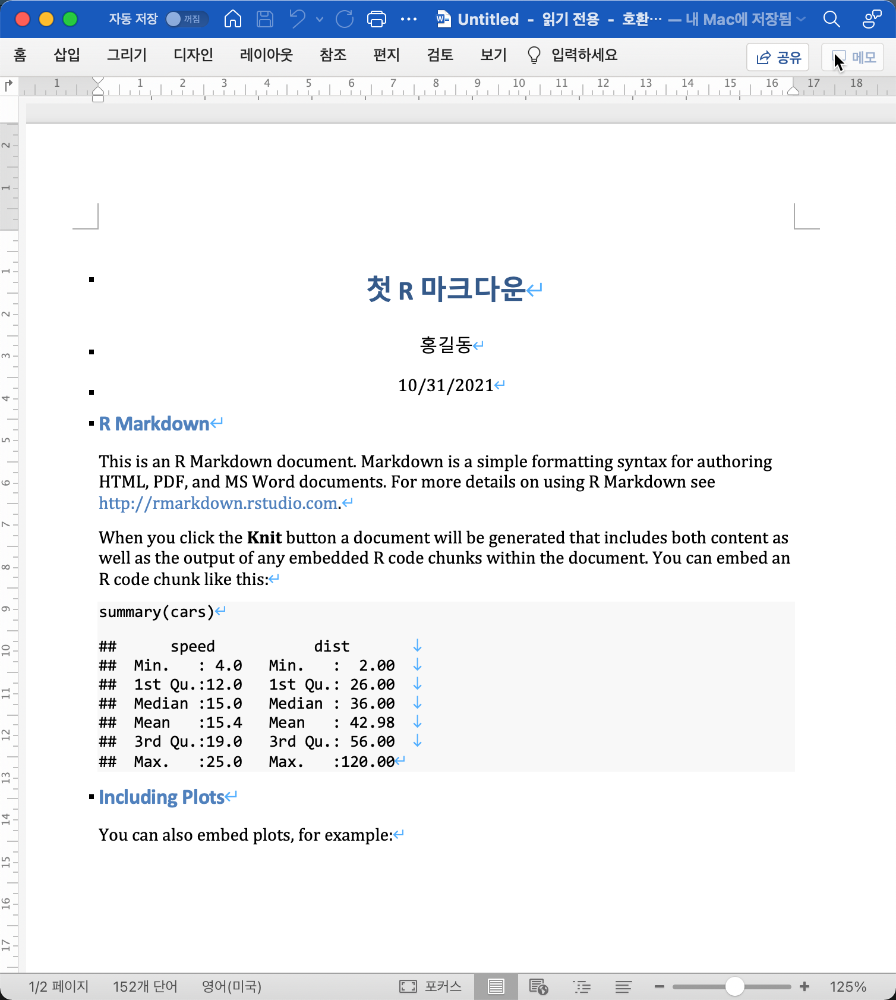
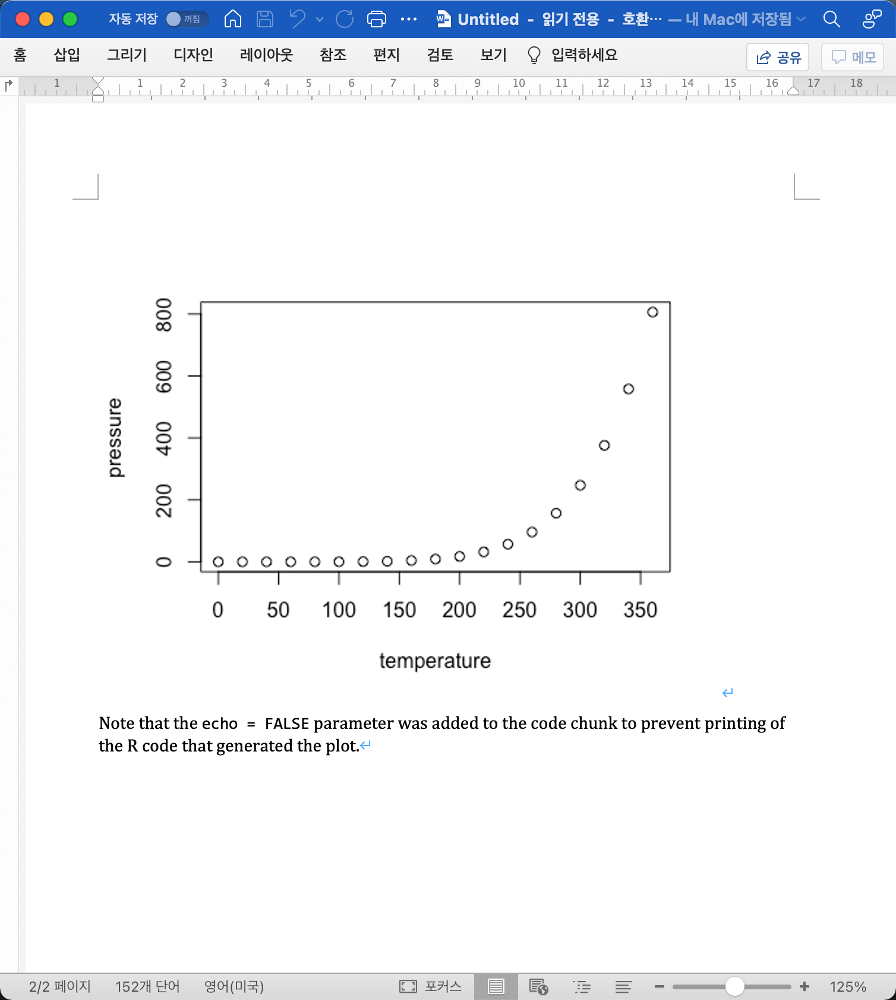
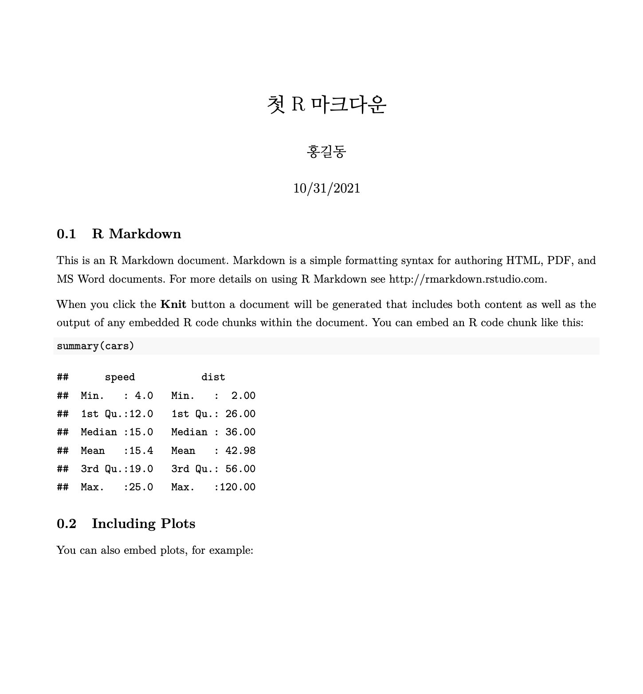
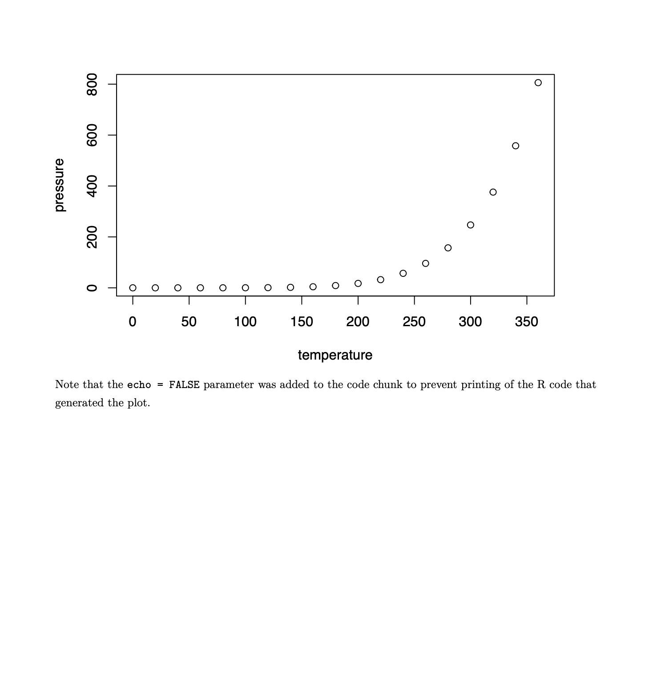
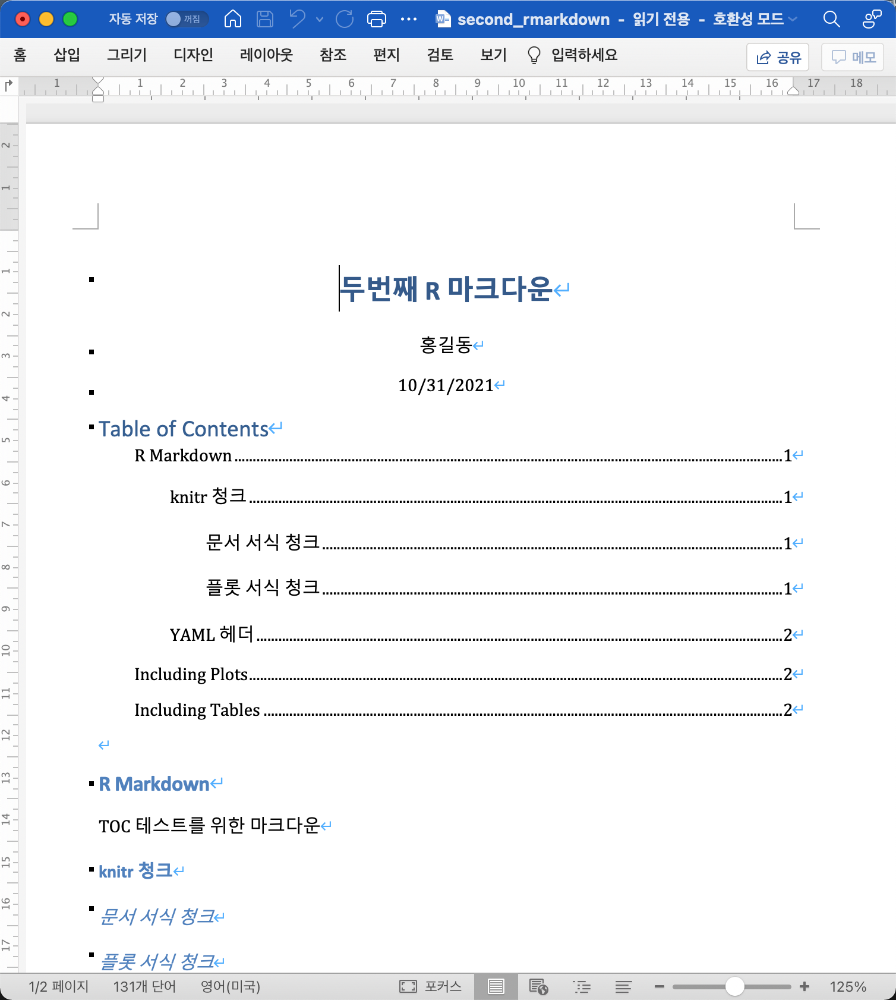
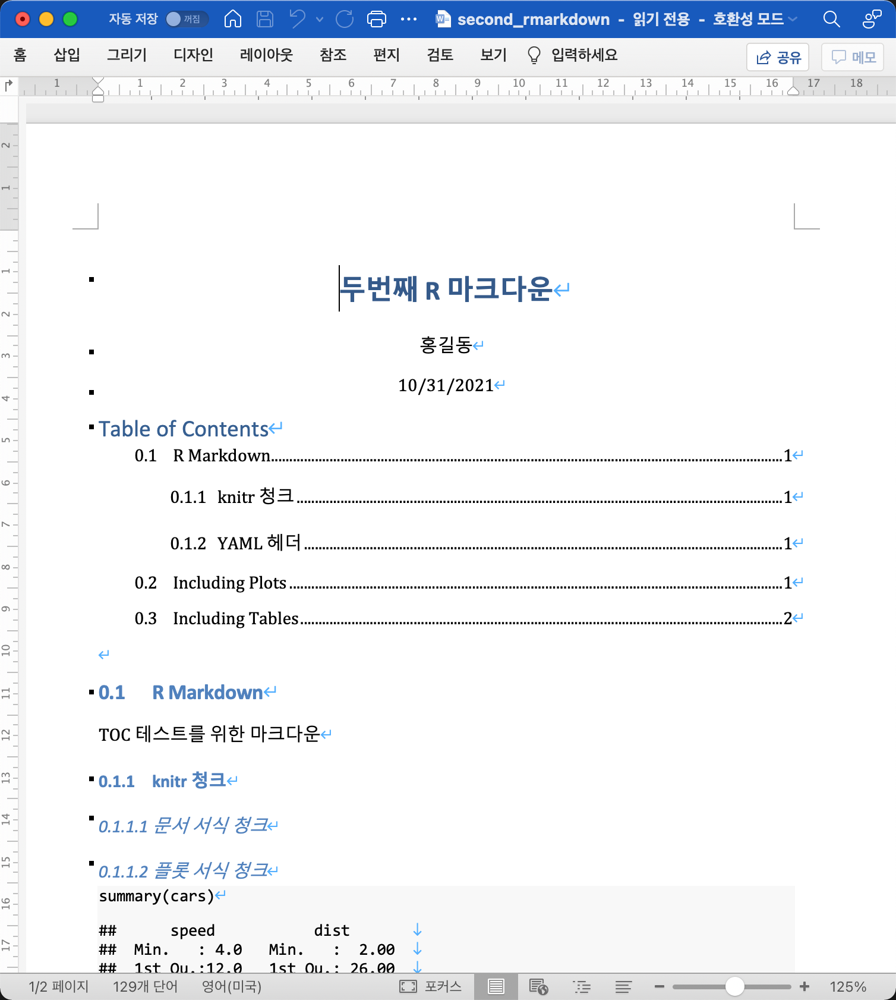

```{r setup, include=FALSE}
knitr::opts_chunk$set(echo = TRUE, 
                      message = FALSE, 
                      warning = FALSE, 
                      collapse = FALSE,
                      fig.align = "center")
knitr::opts_chunk$set(fig.width = 12, fig.height = 9)

library(shiny)
library(htmltools)

xaringanExtra :: use_panelset()
```

```{r tidyverse, echo=FALSE, out.width = "20%"}
knitr::include_graphics("img/rmarkdown.png")
```

```{r, preface, echo=FALSE}
div(class = "preface", 
    h4("들어가기"),
    "문서 파일의 형식을 바꾸거나 전체 페이지의 테마를 바꾸고 싶다구요?!", br(),
    "YAML로 문서 형식을 바꾸고 테마를 변경해 보세요. 그리고 덤으로 R 코드 실행을 위한 파라미터 값 설정으로 같은 포맷 다른 결과의 문서를 만들 수 있습니다.")
```


## R 마크다운 문서의 이해
### R 마크다운 문서의 분해

앞서 만들었던 첫 R 마크다운 문서를 분해하면 다음과 같습니다.

{width=90% height=100%}

* **YAML 헤더**
    + **R 마크다운의 헤더 영역으로, 출력 문서를 세부적으로 제어합니다.**
* R 코드 청크
    + 수행할 R 코드를 포함한 영역입니다.
* 마크다운 태그를 포함한 텍스트
    + 문서의 서식과 텍스트를 정의하는 영역입니다.

### 튜토리얼의 범위

이 튜토리얼은 R 마크다운 문서의 분해 중에서의 **YAML 헤더를 이해할 목적**으로 진행합니다. 동일한 R 마크다운 문서로 어떻게 이질적인 형식의 파일과 모양을 빚어낼 수 있는지를 경험해 보세요.   

## YAML 헤더의 이해

### YAML 헤더는 무엇인가요?

YAML는 ’또 다른 마크업 언어(Yet Another Markup Language)’를 의미합니다. 복잡하고 어렵게 생각하지 마시고 **생성할 문서 전체의 형식을 정의하는 헤더라고 이해**하면 됩니다. 

헤더라는 의미는 R 마크다운 문서의 맨 앞에 위치한다는 것을 의미합니다. 그리고 YAML라는 것을 알려주기 위해서 청크는, "````---````"으로 시작해서 "````---````"로 끝납니다.

### YAML 헤더 예제
이미 우리는 YAML 헤더를 경험했습니다.

````
---
title: "첫 R 마크다운"
author: "홍길동"
date: "10/31/2021"
output: html_document
---
````
YAML 헤더에서 `옵션 이름`과 `옵션 값`은 콜론(:)으로 구분합니다. 한 줄에 한 쌍의 `옵션 이름`과 `옵션 값`이 올 수 있습니다.

title: "첫 R 마크다운"은 문서 제목(타이틀)이 "첫 R 마크다운"임을 의미합니다.
그리고 output: html_document은 생성할 문서 파일이 HTML, 즉 웹 문서임을 rmarkdown 패키지에게 알려줍니다. 그러면 rmarkdown 패키지가 pandoc을 호출하서 웹 문서를 생성하게 됩니다.

어떤 옵션은 서브 옵션을 포함하기도 합니다. 대표적인 것이 `output` 옵션입니다. 서브 옵션은 옵션 다음 줄에 기술해야 하며, 들어쓰기를 하여 자식 옵션임을 알려 주는 것이 헤더를 이해하는데 용이한, 암묵적인 룰입니다. 

다음과 같이 기술하는 것을 권장합니다.

````
output:
  html_document:
    toc: true
````


## 문서파일 형식 변경
### 핸즈온 파일 준비하기
"첫 R 마크다운 문서 만들기" 핸즈온에서 생성한 "first_rmarkdown.Rmd" 파일을 이용하여 핸즈온을 진행하려 합니다. 

만약 파일이 없다면, 

* 핸즈온 튜토리얼을 수행하기 위해서 아래 "YAML 이해하기 튜토리얼 파일" 링크의 R 마크다운 파일을 다운로드합니다.
     + 링크에 마우스를 올려, 오른쪽 버튼으로 "다른이름으로 파일저장"을 실행합니다.
* 다운로드한 파일을 RStudio로 읽어들입니다.     

[YAML 이해하기 튜토리얼 파일](tutorials/first_rmarkdown.Rmd){target="_blank"}

### MS 워드파일 생성하기

#### 1. MS 워드파일 생성하는 YAML 편집하기

> 1. first_rmarkdown.Rmd은 HTML 문서를 생성합니다.
>    + YAML을 수정해서 MS 워드 파일을 생성하세요.
>    + 'first_rmarkdown.Rmd'의 YAML을 변경 후 실행해 보세요.


::: {.panelset}

::: {.panel}
#### 힌트 보기 {.panel-name}
MS 워드파일을 생성하는 몇 가지의 방법이 있습니다. 

1. `새 파일 만들기` 아이콘 클릭 > `New R Markdown` 다이얼로그에서
    + "Default Output Format:"의 Word 레디오 버튼 클릭하여 템플리트 생성/편집 후
    + `knit` 아이콘을 클릭하여 워드파일 생성
2. `knit` 아이콘을 마우스 오론쪽 클릭 후 
    + "Knit to Word"를 선택하여 워드파일 생성    
3. YAML 헤더를 수정하여 워드파일 생성
    + "output:"의 값을 수정
<br>

3번 방법을 사용하세요.
:::

::: {.panel}
#### 모범 답안 {.panel-name}

````
---
title: "첫 R 마크다운"
author: "홍길동"
date: "10/31/2021"
output: word_document
---
````
:::

:::

<br>

생성한 워드파일은 다음과 같은 2페이지를 포함합니다.

```{r image-word, fig.show = "hold", out.width = "50%", echo=FALSE}


```

<br>

### PDF 파일 생성하기
R 마크다운으로 PDF 파일을 생성할 때, knitr은 LaTeX을 만드는 것은 이미 앞에서 다루었습니다.
그런데 PDF 파일을 생성할 때, 한가지 이슈가 발생합니다. 한글이 포함된 R 마크다운 문서의 경우는 다음과 같은 오류가 발생합니다.

````
! Package inputenc Error: Unicode character 홍 (U+D64D)
(inputenc)                not set up for use with LaTeX.

````

이것은 LaTeX이 한글을 처리하지 못해서 발생하는 LaTeX 에러입니다.

한글을 처리하기 위해서는 LaTeX 패키지인 kotex을 사용해야 합니다. 그리고 YAML 헤더에서, LaTeX이 kotex을 사용하도록 설정해 주어야 합니다.

#### 2. PDF 파일 생성하는 YAML 편집하기

> 1. first_rmarkdown.Rmd은 HTML 문서를 생성합니다.
>    + YAML 헤더를 수정해서 PDF 파일을 생성하세요.
>    + 'first_rmarkdown.Rmd'의 YAML을 변경 후 실행해 보세요.
>    + 힌트를 참고해서 kotex을 사용하도록 설정하세요.


::: {.panelset}

::: {.panel}
#### 힌트 보기 {.panel-name}

1. "output:" 옵션으로  "pdf_document:"을 사용하세요.
2. "pdf_document:" 옵션의 서브옵션 "includes:"에 LaTeX 헤더 파일을 설정하세요.  
    + LaTeX 헤더 파일은 "in_header:" 옵션으로 설정합니다.
    + 옵션 값에 "use_korean.tex" 파일을 기술하세요.
3. YAML 헤더를 수정하여 워드파일 생성
    + "output:"의 값을 수정
<br>

"use_korean.tex" 파일은 다음의 내용을 담고 있습니다.
직접 파일을 만들거나, 아래 경로에서 다운로드 받을 수 있습니다.

[use_korean.tex 파일](tutorials/use_korean.tex"){target="_blank"}

````
\usepackage[hangul]{kotex}
````

:::

::: {.panel}
#### 모범 답안 {.panel-name}

````
---
title: "첫 R 마크다운"
author: "홍길동"
date: "10/31/2021"
output:
  pdf_document:
    includes:
      in_header: use_korean.tex
---
````
:::

:::

<br>

생성한 PDF 파일은 다음과 같은 2페이지를 포함합니다.

```{r image-pdf, fig.show = "hold", out.width = "50%", echo=FALSE}


```

<br>

## 문서 서식 변경
### 목차 넣기

하나의 파일에 여러 페이지 분량의 컨텐츠를 담을 수 있는 MS 워드나 PDF는 문서의 앞 부분에 목차(toc, Table of Contents)를 넣을 수 있습니다.
목차는 전체 문서의 구성을 이해하는 데 용이할 뿐아니라 링크를 통해서 해당 빠르게 이동할 수 있는 장점이 있습니다.

#### 3. 문서에 목차를 포함하는 YAML 편집하기

먼저 아래 경로에서 "second_rmarkdown.Rmd" 파일을 다운로드 받으십시요.

[second_rmarkdown.Rmd 파일](tutorials/second_rmarkdown.Rmd"){target="_blank"}

> 1. second_rmarkdown.Rmd을 다운로드합니다.
> 2. 목차를 넣도록 옵션을 추가합니다.
>    + toc 옵션을 사용합니다.
> 3. 목차는 4단계까지의 타이틀을 목차에 포함하십시요.
>    + toc_depth 옵션을 사용합니다.
> 4. 목차에 넣을 타이틀 단계를 변경해가면서 타이틀의 모양을 비교해보십시요.

::: {.panelset}

::: {.panel}
#### 힌트 보기 {.panel-name}

* toc 옵션의 값은 논리값을 사용하는데, 대소문자를 구별하지 않습니다. 
    + true, True, TRUE, flase, False, FALSE로 표현이 가능합니다.
* 본 튜토리얼의 모든 R 마크다운 문서는 가장 큰 타이들을 두번째 타이틀인 ##를 사용합니다.
    + 첫번째 타이틀인 #의 타이틀 제목이 필요 이상으로 커서 두번째 타이틀인 ##를 기준으로 사용합니다.
    + 그러므로 ##의 depth는 2입니다.

:::

::: {.panel}
#### 모범 답안 {.panel-name}

````
---
title: "두번째 R 마크다운"
author: "홍길동"
date: "10/31/2021"
output:
  word_document:
    toc: true
    toc_depth: 4
---
````
:::

:::

<br>

생성한 워드 파일은 다음과 같이 목차를 포함합니다.

```{r image-toc, fig.show = "hold", out.width = "70%", echo=FALSE}

```

<br>


### 목차에 순번 넣기

목차에 순번을 넣을 수 있습니다.

#### 4. 문서에 순번이 있는 목차를 포함하는 YAML 편집하기

> 1. second_rmarkdown.Rmd를 사용합니다.
> 2. 목차를 넣도록 옵션을 추가합니다.
>    + toc 옵션을 사용합니다.
> 3. 목차는 3단계까지의 타이틀을 목차에 포함하십시요.
>    + toc_depth 옵션을 사용합니다.
> 4. 타이틀과 목차에 순번을 넣으십시요.
>    + number_sections 옵션을 사용합니다.

::: {.panelset}

::: {.panel}
#### 힌트 보기 {.panel-name}

* number_sections 옵션의 값은 논리값도 대소문자를 구별하지 않습니다. 

:::

::: {.panel}
#### 모범 답안 {.panel-name}

````
---
title: "두번째 R 마크다운"
author: "홍길동"
date: "10/31/2021"
output:
  word_document:
    toc: true
    toc_depth: 3
    number_sections: true
---
````
:::

:::

<br>

생성한 워드 파일은 다음과 같이 목차를 포함합니다.

```{r image-toc-number, fig.show = "hold", out.width = "70%", echo=FALSE}

```

<br>


## 요약 

### 핸즈온 요약

* R 마크다운 문서로 PDF 파일의 문서를 작성했습니다.
* R 마크다운 문서로 워드 파일의 문서를 작성했습니다.
* R 마크다운 문서에 목차를 삽입하고, 그 모양을 바꾸어 보았습니다.

### I can do it

* YAML 헤더를 사용하며, 생성하는 파일의 포맷을 바꾸고 목차 모양을 원하는대로 조정할 수 있습니다.


