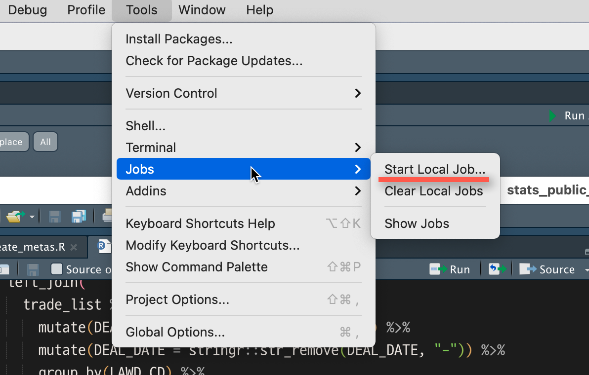
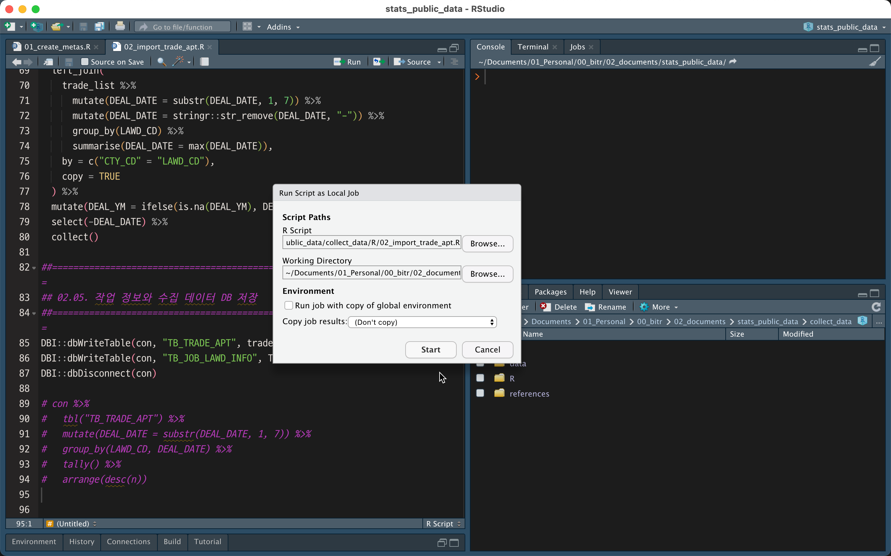
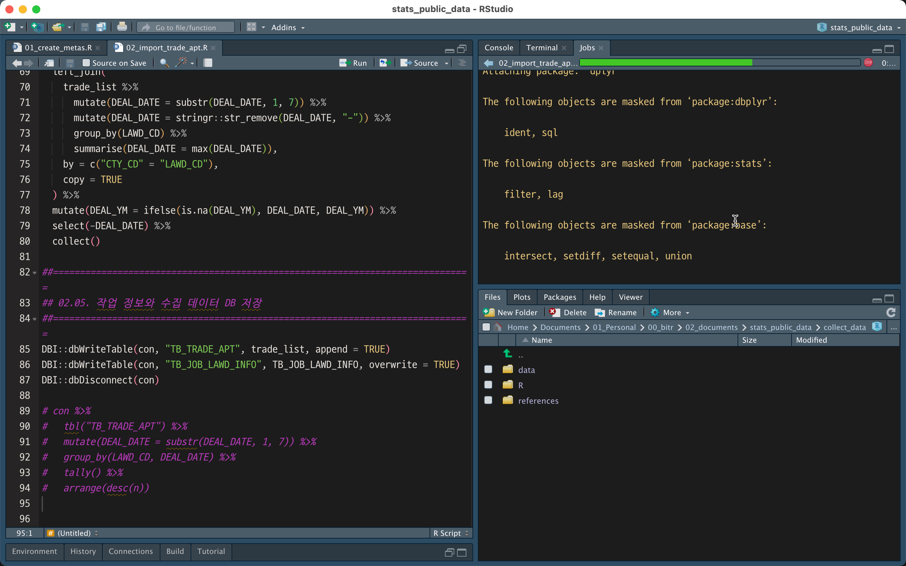
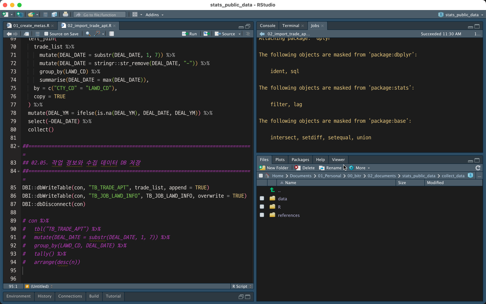
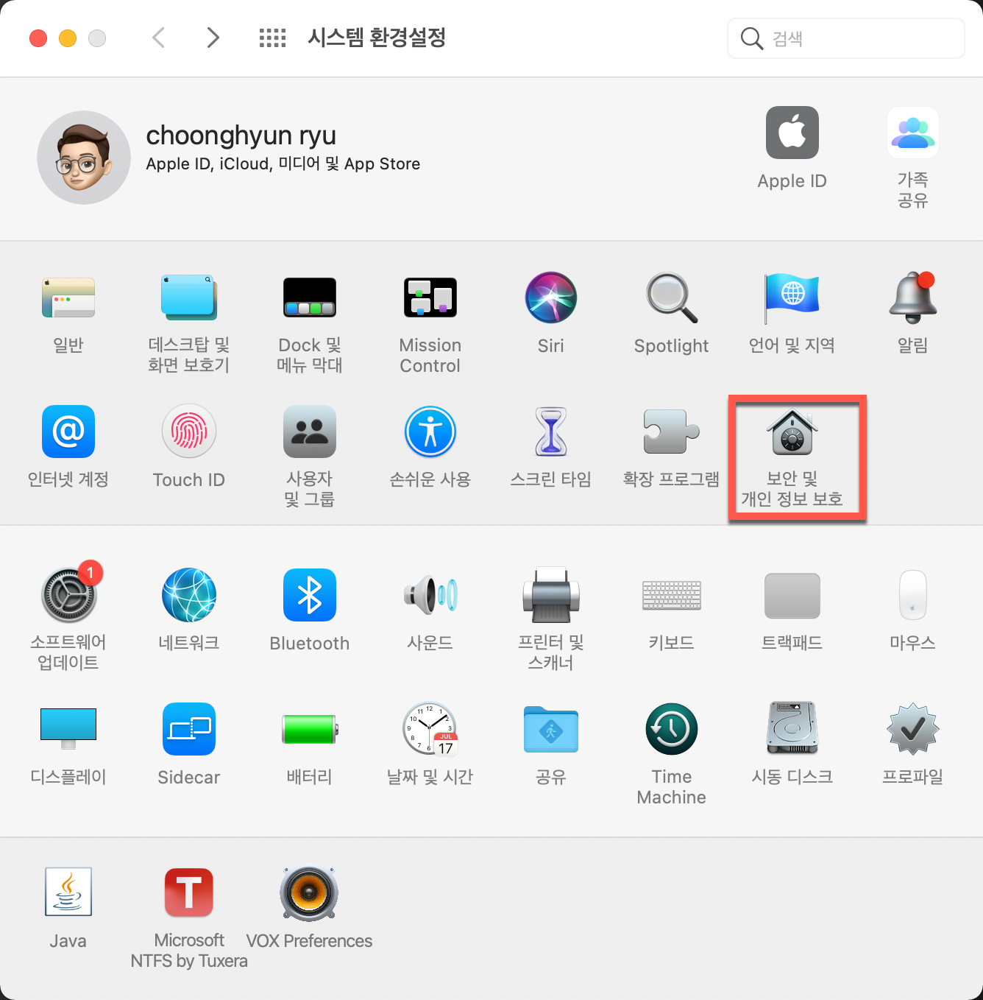
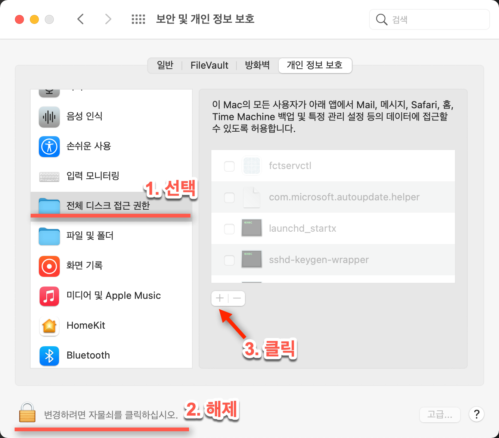
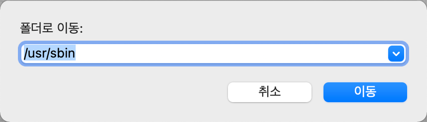
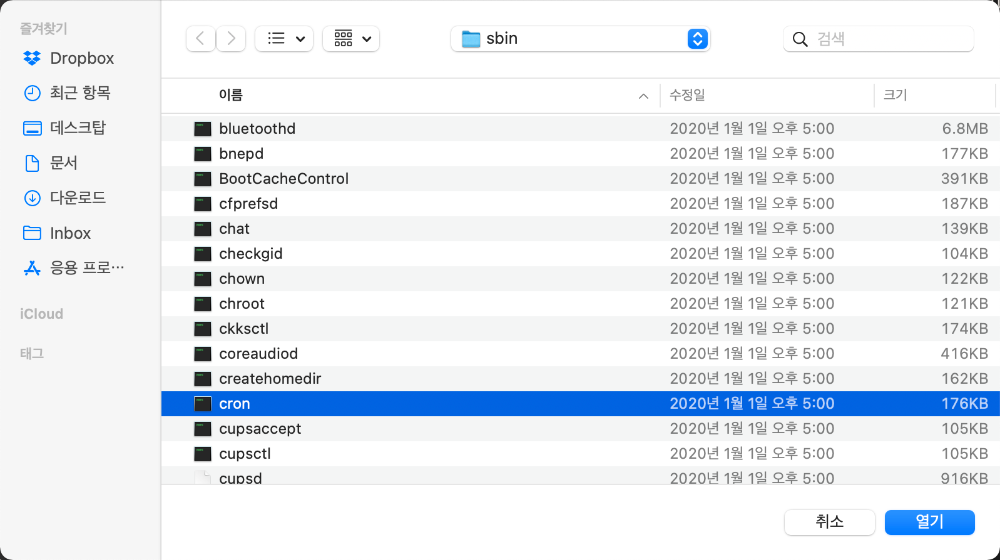
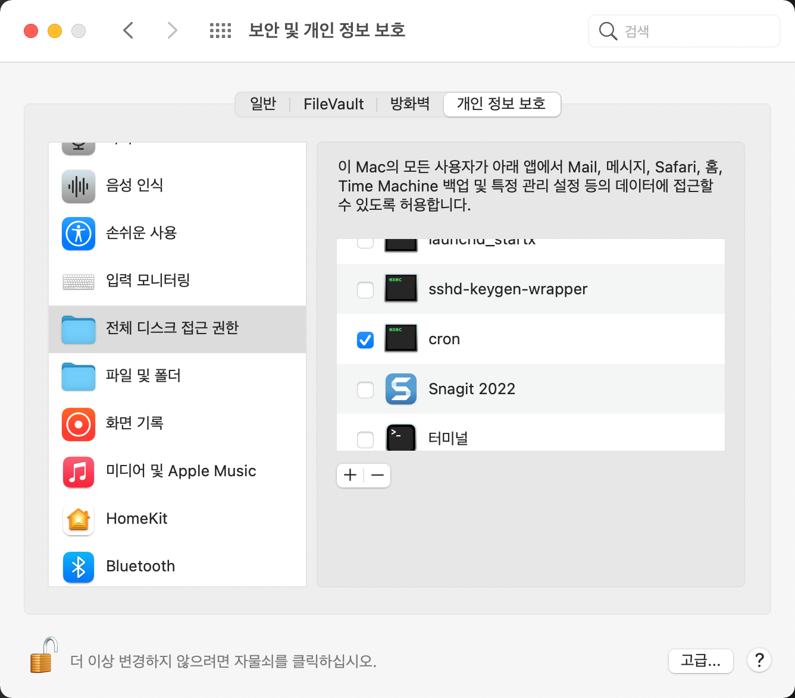

```{r setup, include=FALSE}
knitr::opts_chunk$set(echo = TRUE, 
                      message = FALSE, 
                      warning = FALSE, 
                      collapse = FALSE,
                      fig.align = "center")
library(shiny)
library(htmltools)

xaringanExtra :: use_panelset()
```

```{r news-app, echo=FALSE, out.width = "50%"}

```

```{r, preface, echo=FALSE}
div(class = "preface", 
    h3("들어가기"),
    "주기적으로 자주 실행되는 코드가 있습니다.", strong("한번이 아니라 여러번 실행될 작업"), "입니다.", br(),
    "귀찮을 수 있는 성가신 작업을, 안전하고 쉽게 수행할 방법은 없을까요? 여기 그 해답을 알려 줍니다.",
    style = "margin-bottom: 40px;")
```

## 배치 처리의 이해

### 배치 처리의 정의

다음은 위키백과에 실린 배치 처리의 정의입니다.

"일괄 처리(batch processing)란 최종 **사용자의 개입 없이** 또는 (자원이 허가한다면) 실행을 **스케줄링할 수 있는 작업(job)**의 실행을 의미합니다.[^1] 컴퓨터 **프로그램 흐름에 따라 순차적으로 자료를 처리하는 방식**입니다."

[^1]: https://ko.wikipedia.org/wiki/일괄_처리 발췌
     
여기서 중요한 의미는 다음과 같습니다.

* 프로그램 흐름에 따라 순차적으로 자료를 처리
* 사용자의 개입 없이 스케줄링할 수 있는 작업

### 배치 처리의 활용

아파트 실거래 상세 정보를 수집하기 위해서는 여러 번 API를 호출해야 합니다. 이 API는 2006년 1월부터의 데이터를 제공합니다. 그러므로 2006년 1월 이후의 모든 데이터를 수집하기 위해서는 여러 번이 아니라, 여러 날의 작업이 필요합니다. 왜냐하면 API 호출이 하루에 1,000회로 제한되어 있기 때문입니다.

여기서는 국토교통부의 **아파트매매 실거래 상세 자료를 배치 작업으로 수집하는 방법을 소개**합니다.


## 배치 프로그램 작성

### 대상 지역 데이터 생성

SQLite DBMS에 실거래 상세 자료를 수집할 대상 지역 정보를 저장합니다. koscrap 패키지의 행정구역 코드 정보 데이터인 legal_divisions을 이용합니다. 

```{r, eval=FALSE}
################################################################################
## 01.  Create meta datas
################################################################################
JOB_LAWD_INFO <- koscrap::legal_divisions %>% 
  filter(MAINTAIN %in% "Y") %>% 
  select(MEGA_CD, MEGA_NM, CTY_CD, CTY_NM) %>% 
  unique() %>% 
  mutate(DEAL_YM = NA)
  
################################################################################
## 02.  Export to DBMS
################################################################################
db_name <- here::here("collect_data", "data", "TRADE.sqlite")

con <- DBI::dbConnect(RSQLite::SQLite(), db_name)
DBI::dbWriteTable(con, "TB_JOB_LAWD_INFO", JOB_LAWD_INFO, overwrite = TRUE)
DBI::dbDisconnect(con)
```


### 배치 프로그램 생성
02_import_trade_apt.R 파일에 실거래 상세 자료를 수집하는 메인 프로그램을 다음과 같이 만듭니다.

```{r, eval=FALSE}
################################################################################
## 01. Prepare
################################################################################

cat(glue::glue("Start Job - {lubridate::now()}\n\n"))

##==============================================================================
## 01.01. Load library
##==============================================================================
library("dbplyr")
library("dplyr")

##==============================================================================
## 01.02. Set parameters
##==============================================================================
auth_key <- "XXXXXXXXXXXXXXXXXXXXXXXXXXXXXXXXXXXXXXXXXXXXXXXXXXXXXXXXXXXXXXXXXX"

DEAL_YMD <- "20060101" %>% 
  as.Date(format = "%Y%m%d") %>% 
  seq(to = as.Date("20211201", format = "%Y%m%d"),  by = "month") %>% 
  format("%Y%m")

##==============================================================================
## 01.03. Connect DBMS 
##==============================================================================
db_name <- here::here("collect_data", "data", "TRADE.sqlite")
con <- DBI::dbConnect(RSQLite::SQLite(), db_name)

################################################################################
## 02. Scrap data from REST API server
################################################################################
##==============================================================================
## 02.01. 대상 지역코드 선정
##==============================================================================
LAWD_CD <- con %>% 
  tbl("TB_JOB_LAWD_INFO") %>% 
  filter(is.na(DEAL_YM)) %>% 
  filter(row_number() <= 4) %>% 
  select(CTY_CD) %>% 
  pull()

##==============================================================================
## 02.02. 작업 대상 파라미터 선정
##==============================================================================
conditions <- tidyr::expand_grid(DEAL_YMD, LAWD_CD)

##==============================================================================
## 02.03. Scrap from 국토교통부_아파트매매 실거래 상세 자료 REST server
##==============================================================================
trade_list <- NROW(conditions) %>%
  seq() %>% 
  purrr::map_df({
    function(x) {
      koscrap::trade_apt(auth_key, 
                LAWD_CD = conditions$LAWD_CD[x], 
                DEAL_YMD = conditions$DEAL_YMD[x],
                chunk = 1000,
                do_done = TRUE
      )
    }
  }) %>% 
  mutate(CREATE_DT = as.POSIXlt(date(), format = "%a %b %d %H:%M:%S %Y")) %>% 
  mutate(CREATE_DT = as.character(CREATE_DT))

cat(glue::glue("{NROW(trade_list)} cases of data were collected.\n\n"))

##==============================================================================
## 02.04. 작업 정보 업데이트
##==============================================================================
TB_JOB_LAWD_INFO <- con %>% 
  tbl("TB_JOB_LAWD_INFO") %>% 
  left_join(
    trade_list %>% 
      mutate(DEAL_DATE = substr(DEAL_DATE, 1, 7)) %>%
      mutate(DEAL_DATE = stringr::str_remove(DEAL_DATE, "-")) %>%
      group_by(LAWD_CD) %>% 
      summarise(DEAL_DATE = max(DEAL_DATE)),
    by = c("CTY_CD" = "LAWD_CD"),
    copy = TRUE
  ) %>% 
  mutate(DEAL_YM = ifelse(is.na(DEAL_YM), DEAL_DATE, DEAL_YM)) %>% 
  select(-DEAL_DATE) %>% 
  collect()

##==============================================================================
## 02.05. 작업 정보와 수집 데이터 DB 저장
##==============================================================================
DBI::dbWriteTable(con, "TB_TRADE_APT", trade_list, append = TRUE)
DBI::dbWriteTable(con, "TB_JOB_LAWD_INFO", TB_JOB_LAWD_INFO, overwrite = TRUE)
DBI::dbDisconnect(con)

cat(glue::glue("Finsh Job - {lubridate::now()}\n\n"))
```

## 배치 프로그램 실행

### RStudio 이용한 실행

RStudio의 "Tools > Jobs > Start Local Job..." 메뉴를 선택합니다.




다음과 같은 메뉴 다이얼로그에서 **"R Script"**와 **"Working Directory"**를 선택한 다음, **"Start"** 버튼을 누르면 해당 스크립트인 02_import_trade_apt.R 파일이 실행됩니다.



프로그램이 실행되는 과정에서는 우측 상단처럼 프로그레스 바에서 작업의 진행상태를 확인할 수 있습니다.



프로그램의 실행이 종료되면 다음처럼 프로그레스 바 위치에 작업이 끝났음을 알려주는 정보가 표시됩니다.




### Shell Script를 이용한 실행

Linux나 Mac의 콘솔에서도 배치 작업을 실행할 수 있습니다.

먼저 다음과 같은 **"excute_trade_apt.sh"**이라는 파일의 Shell Script를 작성합니다. 이 스크립트는 R 스크립트가 아닌 쉘 스크립트입니다.

이 스크립트를 실행하기 앞서서 로그를 쌓을 디렉토리를 만들어야 합니다. "./collect_data"가 작업 경로로 가정한다면,
"./collect_data/log" 디렉토리를 미리 생성해 놓습니다.

```{r, eval=FALSE}
#!/bin/sh

# 오늘 날짜
YMD=`date "+%Y-%m-%d"`
# 포르젝트 ㄹ디렉토리
project_dir='/Users/choonghyunryu/Documents/01_Personal/00_bitr/02_documents/stats_public_data'
# 작업 디렉토리
work_dir=`expr $project_dir/collect_data`

# 로그 파일경로 및 이름
log_file=`expr $work_dir/log/trade_apt_$YMD.log`

/usr/local/bin/Rscript $work_dir/R/02_import_trade_apt.R > $log_file
```

그리고 콘솔에서 해당 파일에 실행 권한을 부여합니다.

```{r, eval=FALSE}
chmod +x excute_trade_apt.sh
```

콘솔에서 스크립트를 실행해 봅니다. 다음은 필자의 Mac 콘솔에서 실행한 결과입니다. 패키지가 로딩될 때, 메시지가 콘솔에 출력되었습다.

```{r, eval=FALSE}
(base) choonghyunryu@myWorld R % ./excute_trade_apt.sh 

다음의 패키지를 부착합니다: ‘dplyr’

The following objects are masked from ‘package:dbplyr’:

    ident, sql

The following objects are masked from ‘package:stats’:

    filter, lag

The following objects are masked from ‘package:base’:

    intersect, setdiff, setequal, union
```

이 메시지는 작업에 영향을 주지 않습니다만, 보기 싫다면 다음처럼 배치파일을 수정해서 메시지의 출력을 없애줄 수도 있습니다. library() 함수에 warn.conflicts 인수를 사용해서 메시지 출력을 제거합니다.

```{r, eval=FALSE}
library("dbplyr", warn.conflicts = FALSE)
library("dplyr", warn.conflicts = FALSE)
```


작업 실행 중에 생성된 로그를 확인해 봅니다.

```{r, eval=FALSE}
(base) choonghyunryu@myWorld R % cat ../log/trade_apt_2022-02-09.log
Start Job - 2022-02-09 07:42:52
253602 cases of data were collected.
Finsh Job - 2022-02-09 08:05:38
```

## 배치작업 스케줄링하기
배치작업의 스케줄링에서 가장 일반적인 것은 **Unix-like 시스템의 cron**일 것입이다. 여기서는 cron에 대해서 알아보려 합니다.

### 스케줄 조회하기

cron 스케줄링은 cron table에 정의합니다. cron table에 정의된 스케줄 목록은 Unix-like 시스템의 터미널에서 **crontab -l** 명령어로 조회합니다. 필자는 MacOS에서 수행합니다. MacOS의 터미널도 Unix-like 시스템의 일종이므로 cron을 사용할 수 있습니다.

아직 정의된 cron 스케줄링이 없기 때문에 스케줄이 없다는 메시지가 출력되었습니다.

```{r, eval=FALSE}
(base) choonghyunryu@myWorld R % crontab -l
crontab: no crontab for choonghyunryu
```

### 스케줄 정의하기

이제 스케줄을 정의해 보겠습니다. **crontab -e** 명령어로 스케줄을 수정할 수 있습니다. 아직 정의된 스케줄이 없기 때문에 아무 내용도 없는 에디터(vi 에디터) 화면이 나타납니다. 에디터에 스케줄을 정의한 후 저장합니다.

```{r, eval=FALSE}
(base) choonghyunryu@myWorld R % crontab -e
```

이번에는 cron table에 정의된 스케줄 목록이 출력됩니다. 방금 정의했던 스케줄입니다. 앞서 만들었던 아파트 실거래 상세정보의 쉘 스크립트를 수행하는 스케줄입니다. 매일 새벽 1:00에 excute_trade_apt.sh을 수행하라는 정의입니다.

```{r, eval=FALSE}
(base) choonghyunryu@myWorld R % crontab -l
0 1 * * * /Users/choonghyunryu/Documents/01_Personal/00_bitr/02_documents/stats_public_data/collect_data/R/excute_trade_apt.sh
```

### crontab 스케줄 정의 방법
crontab의 작업 스케줄은 화이트스페이스로 분리된 6개의 컬럼으로 정의하합니다. 6개의 컬럼에 대한 의미는 다음과 같습니다.

```{r, eval=FALSE}
분  시간  일  월  요일 명령어
```
분부터 요일까지의 5개 컬럼은 숫자로 정의하며 다음과 같은 범위에서 정의할 수 있습니다.

* 분: 0 ~ 59
* 시간: 0 ~ 23
* 일: 1 ~ 31  
* 월: 1 ~ 12
* 요일: 0 ~ 7
  - 0과 7은 일요일, 1부터 월요일이며 6은 토요일

아스터리스크(\*)는 해당하는 모든 주기를 의미합니다. 분 위치의 아스터리스크(\*)는 매분을 의미합니다.

그러므로 다음 정의는 매월 첫째날, 8시부터 9시 전까지 매분동안 /home/usr1/run.sh을 실행합니다.

```{r, eval=FALSE}
*  8  1  *  * /home/usr1/run.sh
```

다음 정의는 매일 매시간 0분과 30분에, 즉 30분 주기로 /home/usr1/run.sh을 실행합니다.

```{r, eval=FALSE}
0,30  *  *  *  * /home/usr1/run.sh
```

다음 정의는 자정과 정오에 0분부터 30분까지 매분 /home/usr1/run.sh을 실행합니다.

```{r, eval=FALSE}
0-30  0,12  *  *  * /home/usr1/run.sh
```

## cron 스케줄 Trouble Shooting
cron 스케줄의 수행환경은 별도의 가상환경을 만들어 수행하는 것과 흡사합니다. 그래서 익숙하지 않으면 여러 에러가 발생할 수 있습니다. 여기서는 이런 예기치 못한 에러를 해결하는 방법을 다룹니다.

### Mac에서의 Trouble Shooting 
기대했던 cron 스케줄이 정상적으로 실행된 것 같지 않습니다. 혹시나 해서 mail 박스를 열어봅니다. 터미널에서 **mail 명령어**로 가능합니다. 

일반적으로 cron 스케줄 작업에 대한 로그는 메일로 받을 수 있습니다. 다음과 같은 메일이 와 있었습니다.

```{r, eval=FALSE}
(base) choonghyunryu@myWorld R % mail
Mail version 8.1 6/6/93.  Type ? for help.
"/var/mail/choonghyunryu": 1 message 1 new
>N  1 choonghyunryu@myWorl  Thu Feb 10 07:35  18/903   "Cron <choonghyunryu@myWorld> /Users/choonghyunryu/Documents/01_Personal/00_bitr/02_documents/stats_public_data/collect_da"
? p
Message 1:
From choonghyunryu@myWorld.local  Thu Feb 10 07:35:01 2022
X-Original-To: choonghyunryu
Delivered-To: choonghyunryu@myWorld.local
From: choonghyunryu@myWorld.local (Cron Daemon)
To: choonghyunryu@myWorld.local
Subject: Cron <choonghyunryu@myWorld> /Users/choonghyunryu/Documents/01_Personal/00_bitr/02_documents/stats_public_data/collect_data/R/excute_trade_apt.sh
X-Cron-Env: <SHELL=/bin/sh>
X-Cron-Env: <PATH=/usr/bin:/bin>
X-Cron-Env: <LOGNAME=choonghyunryu>
X-Cron-Env: <USER=choonghyunryu>
Date: Thu, 10 Feb 2022 07:35:00 +0900 (KST)

/bin/bash: /Users/choonghyunryu/Documents/01_Personal/00_bitr/02_documents/stats_public_data/collect_data/R/excute_trade_apt.sh: Operation not permitted

? 
```

**Operation not permitted** 메시지에 주목해야 합니다. 구글링해보니, MacOS의 보안시스템에 관련된 이슈였습니다. 원인은 cron 프로세스가 MacOS 파일시스템의 전체 디렉토리의 접근 권한이 없기 때문입니다.

다음과 같은 과정으로 문제를 해결합니다.

먼저 **시스템 환경설정**에서 **보안 및 개인 정보 보호** 메뉴를 선택합니다.



**보안 및 개인 정보 보호** 메뉴에서 **전체 디스크 접근 권한**을 선택한 후, 자물쇠를 해제하고 **"+"** 버튼을 누릅니다.



**"⌘" + "⇧" + "G" 버튼**을 동시에 누른 후, 나타난 메뉴에 **/usr/sbin을 입력** 후 이동 버튼을 누릅니다.



**/usr/sbin** 경로의 파일에서 **cron**을 선택합니다.



이제 전체 디스크 접근 권한에서 cron이 선택된 것을 확인할 수 있습니다.



### 작업경로 Trouble Shooting 
cron에 등록할 프로그램에서 파일의 경로는 상대경로가 아닌, 절대경로를 사용해야 합니다. 

excute_trade_apt.sh에서는 here 패키지를 이용해서 SQLite DBMS의 경로를 상대경로로 지정했습니다. 그래서 cron에서 다음과 같은 에러가 발생했습니다. 상대경로로 정의했던 DBMS 위치라서, DBMS에 접속하지 못했습니다. 

```{r, eval=FALSE}
(base) choonghyunryu@myWorld R % mail
Mail version 8.1 6/6/93.  Type ? for help.
"/var/mail/choonghyunryu": 1 message 1 new
>N  1 choonghyunryu@myWorl  Thu Feb 10 08:02  20/834   "Cron <choonghyunryu@myWorld> /Users/choonghyunryu/Documents/01_Personal/00_bitr/02_documents/stats_public_data/collect_da"
? p
Message 1:
From choonghyunryu@myWorld.local  Thu Feb 10 08:02:03 2022
X-Original-To: choonghyunryu
Delivered-To: choonghyunryu@myWorld.local
From: choonghyunryu@myWorld.local (Cron Daemon)
To: choonghyunryu@myWorld.local
Subject: Cron <choonghyunryu@myWorld> /Users/choonghyunryu/Documents/01_Personal/00_bitr/02_documents/stats_public_data/collect_data/R/excute_trade_apt.sh
X-Cron-Env: <SHELL=/bin/sh>
X-Cron-Env: <PATH=/usr/bin:/bin>
X-Cron-Env: <LOGNAME=choonghyunryu>
X-Cron-Env: <USER=choonghyunryu>
Date: Thu, 10 Feb 2022 08:02:02 +0900 (KST)

Error: Could not connect to database:
unable to open database file
Execution halted

? 
```

그래서 DBMS에 접속하는 로직을 다음과 같이 수정했습니다. 주석으로 처리한 부분이 기존의 상대경로 정의입니다. 이 부분을 절대경로 위치로 바꿨습니다.

```{r, eval=FALSE}
##==============================================================================
## 01.03. Connect DBMS
##==============================================================================
#db_name <- here::here("collect_data", "data", "TRADE.sqlite")
db_name <- "/Users/choonghyunryu/Documents/01_Personal/00_bitr/02_documents/stats_public_data/collect_data/data/TRADE.sqlite"
con <- DBI::dbConnect(RSQLite::SQLite(), db_name)
```

### 한글환경 Trouble Shooting 

절대경로로 변경하여, 해당 이슈는 해결되었습니다. 그런데 이번에는 한글과 관련된 에러가 발생했습니다.

```{r, eval=FALSE}
(base) choonghyunryu@myWorld R % mail  
Mail version 8.1 6/6/93.  Type ? for help.
"/var/mail/choonghyunryu": 1 message 1 new
>N  1 choonghyunryu@myWorl  Thu Feb 10 08:20  51/2542  "Cron <choonghyunryu@myWorld> /Users/choonghyunryu/Documents/01_Personal/00_bitr/02_documents/stats_public_data/collect_da"
? p
Message 1:
From choonghyunryu@myWorld.local  Thu Feb 10 08:20:05 2022
X-Original-To: choonghyunryu
Delivered-To: choonghyunryu@myWorld.local
From: choonghyunryu@myWorld.local (Cron Daemon)
To: choonghyunryu@myWorld.local
Subject: Cron <choonghyunryu@myWorld> /Users/choonghyunryu/Documents/01_Personal/00_bitr/02_documents/stats_public_data/collect_data/R/excute_trade_apt.sh
X-Cron-Env: <SHELL=/bin/sh>
X-Cron-Env: <PATH=/usr/bin:/bin>
X-Cron-Env: <LOGNAME=choonghyunryu>
X-Cron-Env: <USER=choonghyunryu>
Date: Thu, 10 Feb 2022 08:20:04 +0900 (KST)

Error: 
  Problem with `mutate()` column `<U+AC70><U+B798><U+AE08><U+C561>`.
  i `<U+AC70><U+B798><U+AE08><U+C561> = stringr::str_remove(`\uac70\ub798\uae08\uc561`, ",") %>% ...`.
  x object '<U+AC70><U+B798><U+AE08><U+C561>' not found
Caused by error in `stri_replace_first_regex()`: 
  object '<U+AC70><U+B798><U+AE08><U+C561>' not found
Backtrace:
     x
  1. +-... %>% mutate(CREATE_DT = as.character(CREATE_DT))
  2. +-dplyr::mutate(., CREATE_DT = as.character(CREATE_DT))
  3. +-dplyr::mutate(., CREATE_DT = as.POSIXlt(date(), format = "%a %b %d %H:%M:%S %Y"))
  4. +-purrr::map_df(...)
  5. | \-purrr::map(.x, .f, ...)
  6. |   \-.f(.x[[i]], ...)
  7. |     \-koscrap::trade_apt(...)
  8. |       \-doc %>% get_list() at koscrap/R/trade_apt.R:126:2
  9. +-koscrap get_list(.)
 10. | \-... %>% ... at koscrap/R/trade_apt.R:66:4
 11. +-dplyr::select(...)
 12. +-dplyr::select(., -`<U+B144>`, -`<U+C6D4>`, -`<U+C77C>`)
 13. +-dplyr::mutate(., `<U+AC74><U+CD95><U+B144><U+B3C4>` = as.integer(`<U+AC74><U+CD95><U+B144><U+B3C4>`))
 14. +-dplyr::mutate(., `<U+CE35>` = as.integer(`<U+CE35>`))
 15. +-dplyr::mutate(., DEAL_DATE = glue::glue("{<U+B144>}-{str_pad(<U+C6D4>, width = 2, pad = '0')}-{\n                                  str_pad(<U+C77C>, width = 2, pad = '0')}"))
 16. +-dplyr::mutate(...)
 17. +-dplyr:::mutate.data.frame(...)
 18. | \-dplyr:::mutate_cols(.data, ..., caller_env = caller_env())
 19. |   +-base::withCallingHandlers(...)
 20. |   \-mask$eval_all_mutate(quo)
 21. +-stringr::str_remove(`\uac70\ub798\uae08\uc561`, ",") %>% ...
 22. \-stringr::str_remove(`<U+AC70><U+B798><U+AE08><U+C561>`, ",")
 23.   \-stringr::str_replace(string, pattern, "")
 24.     \-stringi::stri_replace_first_regex(...)
There were 27 warnings (use warnings() to see them)
Execution halted
```

cron에서 한글 이슈가 발생하면, shell script에 다음처럼 **export LANG=ko_KR.UTF-8**구문을 삽입합니다.


```{r, eval=FALSE}
#!/bin/bash

# 한글 환경 설정
export LANG=ko_KR.UTF-8

# 오늘 날짜
YMD=`date "+%Y-%m-%d"`
# 프로젝트 디렉토리
project_dir='/Users/choonghyunryu/Documents/01_Personal/00_bitr/02_documents/stats_public_data'
# 작업 디렉토리
work_dir="$project_dir"/collect_data

# 로그 파일경로 및 이름
log_file="$work_dir"/log/trade_apt_"$YMD".log

/usr/local/bin/Rscript "$work_dir"/R/02_import_trade_apt.R > "$log_file"
```


### tidyverse 한글환경 Trouble Shooting 

한글 문제가 해결되었습니다. 그런데 이번에는 한글변수에서 에러가 발생했습니다.
애초 프로그램 언어에서의 사이드 이펙트(부작용, side effect)를 방지하기 위해서의 최선의 방법은 변수의 이름을 영문으로 정의하는 것이 암묵적인 룰인데, 국토교통부의 오픈 API는 변수 이름을 한글로 지정한 것이 안일한 결정이었습니다.

R 환경이난 Shell 환경에는 분명 정상적으로 수행되던 코드가 cron에서 에러가 발생합니다. tidyverse 패키지군인 dplyr 패키지에서 한글변수를 찾지 못하는 에러가 발생한 것입니다.

```{r, eval=FALSE}
(base) choonghyunryu@myWorld R % mail
Mail version 8.1 6/6/93.  Type ? for help.
"/var/mail/choonghyunryu": 1 message 1 new
>N  1 choonghyunryu@myWorl  Thu Feb 10 08:28  50/2451  "Cron <choonghyunryu@myWorld> /Users/choonghyunryu/Documents/01_Personal/00_bitr/02_documents/stats_public_data/collect_da"
? p
Message 1:
From choonghyunryu@myWorld.local  Thu Feb 10 08:28:04 2022
X-Original-To: choonghyunryu
Delivered-To: choonghyunryu@myWorld.local
From: choonghyunryu@myWorld.local (Cron Daemon)
To: choonghyunryu@myWorld.local
Subject: Cron <choonghyunryu@myWorld> /Users/choonghyunryu/Documents/01_Personal/00_bitr/02_documents/stats_public_data/collect_data/R/excute_trade_apt.sh
X-Cron-Env: <SHELL=/bin/sh>
X-Cron-Env: <PATH=/usr/bin:/bin>
X-Cron-Env: <LOGNAME=choonghyunryu>
X-Cron-Env: <USER=choonghyunryu>
Date: Thu, 10 Feb 2022 08:28:03 +0900 (KST)

Error: 
  Problem with `mutate()` column `거래금액`.
  ℹ `거래금액 = stringr::str_remove(거래금액, ",") %>% as.integer()`.
  ✖ 객체 '거래금액'를 찾을 수 없습니다
Caused by error in `stri_replace_first_regex()`: 
  객체 '거래금액'를 찾을 수 없습니다
Backtrace:
     ▆
  1. ├─... %>% mutate(CREATE_DT = as.character(CREATE_DT))
  2. ├─dplyr::mutate(., CREATE_DT = as.character(CREATE_DT))
  3. ├─dplyr::mutate(., CREATE_DT = as.POSIXlt(date(), format = "%a %b %d %H:%M:%S %Y"))
  4. ├─purrr::map_df(...)
  5. │ └─purrr::map(.x, .f, ...)
  6. │   └─.f(.x[[i]], ...)
  7. │     └─koscrap::trade_apt(...)
  8. │       └─doc %>% get_list() at koscrap/R/trade_apt.R:126:2
  9. ├─koscrap get_list(.)
 10. │ └─... %>% ... at koscrap/R/trade_apt.R:66:4
 11. ├─dplyr::select(...)
 12. ├─dplyr::select(., -년, -월, -일)
 13. ├─dplyr::mutate(., 건축년도 = as.integer(건축년도))
 14. ├─dplyr::mutate(., 층 = as.integer(층))
 15. ├─dplyr::mutate(., DEAL_DATE = glue::glue("{년}-{str_pad(월, width = 2, pad = '0')}-{str_pad(일, width = 2, pad = '0')}"))
 16. ├─dplyr::mutate(...)
 17. ├─dplyr:::mutate.data.frame(...)
 18. │ └─dplyr:::mutate_cols(.data, ..., caller_env = caller_env())
 19. │   ├─base::withCallingHandlers(...)
 20. │   └─mask$eval_all_mutate(quo)
 21. ├─stringr::str_remove(거래금액, ",") %>% as.integer()
 22. └─stringr::str_remove(거래금액, ",")
 23.   └─stringr::str_replace(string, pattern, "")
 24.     └─stringi::stri_replace_first_regex(...)
실행이 정지되었습니다
```

여러 방법을 시도해보았고, 구글해보았지만 솔루션을 찾지 못했습니다. 그래서 다음처럼 아주 기본적으로 접근했습니다.
데이터 프레임을 만들고, 변수의 이름을 영문으로 고친 후 dplyr 구문을 사용하는 것으로 코드를 수정하였습니다.

koscape 패키지의 trade_apt() 함수 내에서의 get_list() 함수를 다음과 같이 수정하였습니다. 

::: {.panelset}

::: {.panel}
#### 이전 코드 {.panel-name}

```{r, eval=FALSE, echo=TRUE}
  get_list <- function(doc) {
    doc %>%
      XML::getNodeSet("//item") %>%
      XML::xmlToDataFrame() %>%
      mutate(거래금액 = as.integer(stringr::str_remove(거래금액, ","))) %>%
      mutate(DEAL_DATE =
               glue::glue("{년}-{str_pad(월, width = 2, pad = '0')}-{str_pad(일, width = 2, pad = '0')}")) %>%
      mutate(층 = as.integer(층)) %>%
      mutate(건축년도 = as.integer(건축년도)) %>%
      select(-년, -월, -일) %>%
      select("LAWD_CD"       = 지역코드,
             DEAL_DATE,
             "SERIAL"        = 일련번호,
             "DEAL_TYPE"     = 거래유형,
             "BUILD_NM"      = 아파트,
             "FLOOR"         = 층,
             "BUILD_YEAR"    = 건축년도,
             "AREA"          = 전용면적,
             "AMOUNT"        = 거래금액,
             "ROAD_CD"       = 도로명코드,
             "ROAD_NM"       = 도로명,
             "BUILD_MAJOR"   = 도로명건물본번호코드,
             "BUILD_MINOR"   = 도로명건물부번호코드,
             "ROAD_SEQ"      = 도로명일련번호코드,
             "BASEMENT_FLAG" = 도로명지상지하코드,
             "LAND_NO"       = 지번,
             "DONG_NM"       = 법정동,
             "DONG_MAJOR"    = 법정동본번코드,
             "DONG_MINOR"    = 법정동부번코드,
             "EUBMYNDONG_CD" = 법정동읍면동코드,
             "DONG_LAND_NO"  = 법정동지번코드,
             "DEALER_ADDR"   = 중개사소재지,
             "CANCEL_DEAL"   = 해제여부,
             "CANCEL_DATE"   = 해제사유발생일)
  }
```

:::

::: {.panel}
#### 수정 코드 {.panel-name}

```{r, eval=FALSE, echo=TRUE}
  get_list <- function(doc) {
    dframe <- doc %>%
      XML::getNodeSet("//item") %>%
      XML::xmlToDataFrame()

    if (NROW(dframe) == 0) {
      return(data.frame())
    }

    vname <- c("AMOUNT", "DEAL_TYPE", "BUILD_YEAR", "YEAR", "ROAD_NM",
               "BUILD_MAJOR", "BUILD_MINOR", "ROAD_ADMI", "ROAD_SEQ",
               "BASEMENT_FLAG", "ROAD_CD", "DONG_NM", "DONG_MAJOR",
               "DONG_MINOR", "DONG_ADMI", "EUBMYNDONG_CD", "DONG_LAND_NO",
               "BUILD_NM", "MONTH", "DAY", "SERIAL", "AREA", "DEALER_ADDR",
               "LAND_NO", "LAWD_CD", "FLOOR", "CANCEL_DATE", "CANCEL_DEAL")
    names(dframe) <- vname

    dframe %>%
      select("LAWD_CD", "YEAR", "MONTH", "DAY", "SERIAL", "DEAL_TYPE",
             "BUILD_NM", "FLOOR", "BUILD_YEAR", "AREA", "AMOUNT", "ROAD_CD",
             "ROAD_NM", "BUILD_MAJOR", "BUILD_MINOR", "ROAD_SEQ",
             "BASEMENT_FLAG", "LAND_NO", "DONG_NM", "DONG_MAJOR", "DONG_MINOR",
             "EUBMYNDONG_CD", "DONG_LAND_NO", "DEALER_ADDR", "CANCEL_DEAL",
             "CANCEL_DATE") %>%
      mutate(DEAL_DATE = 
               glue::glue("{YEAR}-{str_pad(MONTH, width = 2, pad = '0')}-{str_pad(DAY, width = 2, pad = '0')}")) %>%
      mutate(AMOUNT = as.integer(stringr::str_remove(AMOUNT, ","))) %>%
      mutate(FLOOR = as.integer(FLOOR)) %>%
      mutate(BUILD_YEAR = as.integer(BUILD_YEAR)) %>%
      select(LAWD_CD, DEAL_DATE, SERIAL:CANCEL_DATE)
  }
```

:::

:::


 