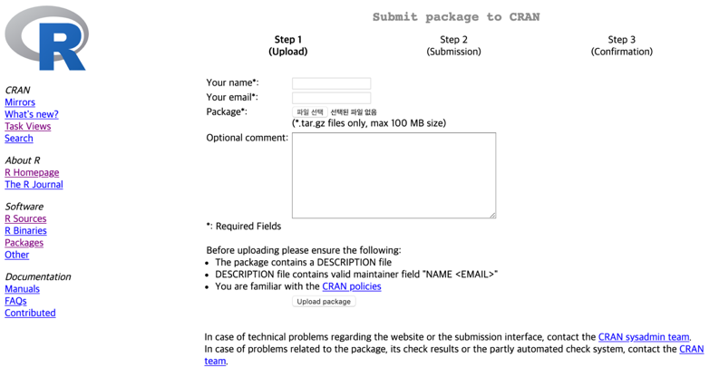
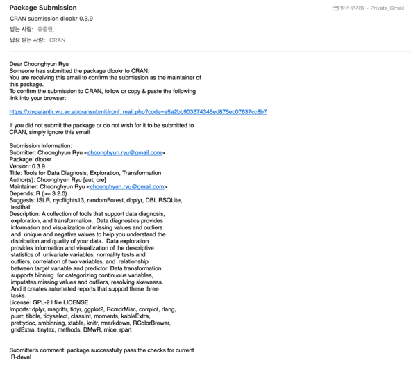
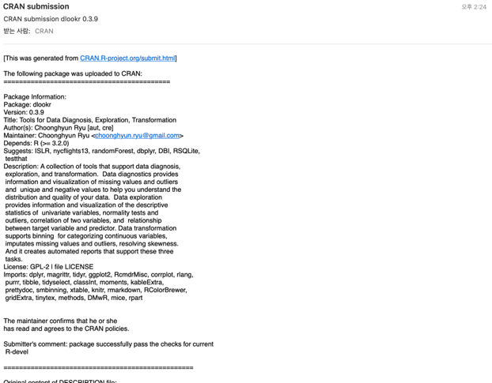
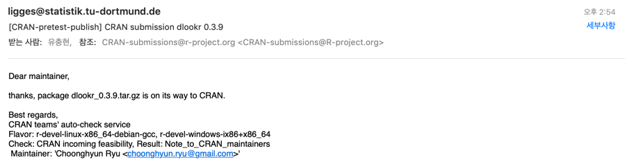

```{r setup, include=FALSE}
knitr::opts_chunk$set(echo = FALSE)
```

## 개요

CRAN에 패키지를 submit하는 방법을 간단하게 다룹니다. 또한 CRAN에 패키지를 submit하기 위해서는 R-devel 환경에서도 무결성을 check해야 합니다. 생략할 수도 있지만, 특정 기능이 R development 버전에서 오류가 발생할 수도 있기 때문이다. 반드시 수행해야 합니다.

본 note에서는 Mac OS X 버전의 R 3.5.2 환경에서 개발 버전을 설치하는 방법과 CRAN에 패키지를 submit하는 방법을 개괄적으로 다룹니다.

```{r env, prompt=TRUE, comment=""}
sessionInfo()
```

[Building R-devel on Mac OS X](https://tomizonor.wordpress.com/2013/09/26/build-r-devel-mac/){target="_blank"}를 참고하였습다.

# R-devel 환경 만들기
아마 대부분의 R 사용자는 버전 번호는 다르지만, stable 버전의 R을 사용하고 있을 것입니다. 필자도 R을 CRAN에 제출하기 위해서 R development 버전을 설치하였습니다.

## Downloading R-devel

다음처럼 https://stat.ethz.ch/R/daily URL에서 최신 R development 버전을 다운로드 합니다.:

```{r eval=FALSE}
curl -O https://stat.ethz.ch/R/daily/R-devel_2019-03-15.tar.gz
```

## Building R-devel

소스 파일의 압축을 풉니다.:

```{r eval=FALSE}
tar xvzf R-devel_2019-03-15.tar.gz
cd R-devel
```

conifg.site 파일의 `FC` 변수를 다음과 같이 정의합니다.

```
F77="gfortran -arch x86_64"
FC=$F77
```
소스 파일을 컴파일 합니다. CRAN에 패키지를 제출할 때 무결성 체크를 위한 목적으로만 사용하기 때문에 Gui 환경의 binary를 생성하지 않을 것입니다. configure 명령을 --without-x 옵션으로 수행하면 됩니다.

```{r eval=FALSE}
./configure --without-x
make
make check
make pdf
make info
```

## Install R-devel
Mac OS X 환경에서 prefix 변수의 값을 지정하지 않으면, 현재 설치된 stable 버전을 엎어칩니다. 그러므로 반드시 설치할 경로를 지정해야 합니다. 필자는 `/usr/local/lib/R-devel` 경로에 개발 버전을 설치하였습니다.

```{r eval=FALSE}
make prefix=/usr/local/lib/R-devel install
```

이상으로 개발 버전을 설치하였다. 그리고 개발 버전은 다음과 같이 실행합니다.:

```{r eval=FALSE}
/usr/local/lib/R-devel/bin/R
```

다음처럼 심볼릭 링크를 생성하면 쉽게 사용할 수 있습니다.:

```{r eval=FALSE}
ln -s /usr/local/lib/R-devel/bin/R /usr/local/bin/R-devel
```

이제는 콘솔에서 `R-devel`만 입력하면 R 개발 버전이 실행될 것입니다. 그러므로 다음과 같이 개발 버전 환경에서 패키지를 체크할 수 있습니다.

> R-devel CMD check --as-cran 패키지이름.tar.gz 

# CRAN에 패키지 등록하기
CRAN에 패키지를 등록하기 위해서는 몇 가지의 제약을 준수해야 합니다. 어쩌면 매우 까다로운 작업일 수도 있습니다. 아마 처음 패키지를 등록하는 패키지 개발자는 당황할 수도 있습니다.

## build package
다음과 같이 패키지를 build합니다. 여기서는 dlookr 0.3.9 버전을 기준으로 설명합니다.

예제에서 `dlookr`은 패키지 디렉토리를 의미합니다. `R CMD build` 명령로 패키지를 생성합니다.

```{r eval=FALSE}
R CMD build dlookr
```

상기 명령이 수행되면 `DESCRIPTION` 파일에서 패키지의 버전 번호를 가져와 컴파일된 패키지 파일을 생성합니다. 그러므로 `dlookr_0.3.9.tar.gz`이라는 파일이 생성됩니다.

패키지의 무결성을 진단하기 위해서 다음의 명령을 차례로 입력합니다.:

```{r eval=FALSE}
R CMD check --as-cran dlookr_0.3.9.tar.gz
R-devel CMD check --as-cran dlookr_0.3.9.tar.gz
```

오랜 시간동안 명령어가 수행됩니다. `Error`, `Warning`, `Note` 등이 발생된다면 원인을 찾아 수정해야 합니다. 그리고 그것들이 발생하지 않아야 CRAN에 제출할 수 있습니다.

## submit package

`https://cran.r-project.org/submit.html` URL에서 패키지를 제출합니다. 이 URL은 그림\ref{fig:submit_url}처럼 개발자 이름, 이메일 주소 등을 입력하고 패키지 파일을 업로드할 수 있는 컴포넌트로 구성됩니다.

```{r done_gtk, fig.align='center', fig.pos='!ht', echo=FALSE, out.width = '90%', fig.cap="R 패키지 제출 화면"}

```

정보를 입력하고, 파일을 업로드하면 면 단계 화면을 거치고 기술한 이메일 주소로 Submit 확인 메일이 발송됩니다. 발송된 메일의 URL에서 최종 제출 작업을 수행해야 합니다. 메일의 내용은 그림\ref{fig:confirm}처럼 URL 링크를 포함하고 있습니다.

```{r confirm, fig.align='center', fig.pos='!ht', echo=FALSE, out.width = '90%', fig.cap="R 패키지 제출 확인 메일"}

```

패키지가 제출되면 몇 분 간격으로 접수되었다는 메일(그림\ref{fig:received})과 CRAN 사이트에 제출된 버전이 올라간다는 메일(그림\ref{fig:goto_cran})이 발송됩니다. 물론 제출된 패키지가 check에서 이상이 없었을 경우입니다.

```{r received, fig.align='center', fig.pos='!ht', echo=FALSE, out.width = '90%', fig.cap="R 패키지 접수 확인 메일"}

```

대부분의 정보는 `DESCRIPTION` 파일에 기재된 내용의 요약입니다.

```{r goto_cran, fig.align='center', fig.pos='!ht', echo=FALSE, out.width = '90%', fig.cap="R 패키지 등록 확인 메일"}

```

접수 확인 메일 발송 후 정확히 30분 이후에 CRAN으로 패키지가 등록된다는 메일이 발송됨을 알 수 있습니다.

