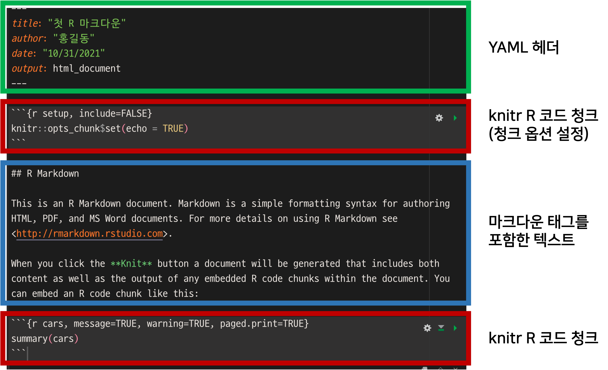
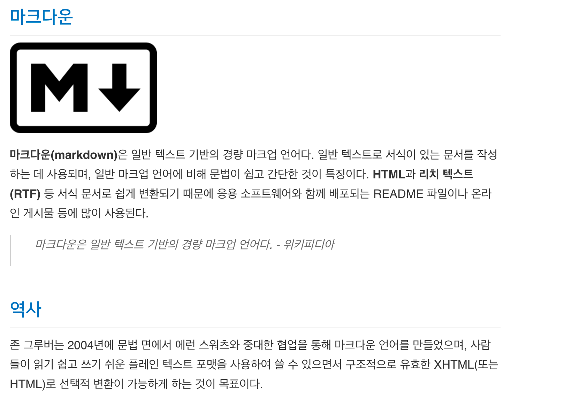

```{r setup, include=FALSE}
knitr::opts_chunk$set(echo = TRUE, 
                      message = FALSE, 
                      warning = FALSE, 
                      collapse = FALSE,
                      fig.align = "center")
knitr::opts_chunk$set(fig.width = 12, fig.height = 9)

library(shiny)
library(htmltools)

xaringanExtra :: use_panelset()
```

```{r tidyverse, echo=FALSE, out.width = "20%"}
knitr::include_graphics("img/markdown.png")
```

```{r, preface, echo=FALSE}
div(class = "preface", 
    h4("들어가기"),
    "이제 당신은 에디터가 되고 작가가 됩니다.", br(),
    "마크다운 태그를 이해하면, 마크다운 조판을 통해 멋진 글을 문서로 만들고 책을 출판할 수도 있습니다.", br(),
    "마크다운은 쉽고 빠릅니다. 물론 학습도 빠르겠지요.")
```

## R 마크다운 문서의 이해
### R 마크다운 문서의 분해

앞서 만들었던 첫 R 마크다운 문서를 분해하면 다음과 같습니다.

{width=90% height=100%}

* YAML 헤더
    + R 마크다운의 헤더 영역으로, 출력 문서를 세부적으로 제어합니다.
* R 코드 청크
    + 수행할 R 코드를 포함한 영역입니다.
* **마크다운 태그를 포함한 텍스트**
    + **문서의 서식과 텍스트를 정의하는 영역입니다.**

### 튜토리얼의 범위

이 튜토리얼은 R 마크다운 문서의 분해 중에서의 **마크다운 태그를 이해할 목적**으로 진행합니다. 동일한 마크다운 문서로 어떻게 서식이 적용된 그럴싸한 문서를 만들 수 있는지, 실습을 통해 편집자가 되어보세요.   

## 마크다운의 이해

### 마크다운은 무엇인가요?

마크다운(Markdown)은 일반 텍스트 기반의 경량 **마크업 언어**입니다. 일반 텍스트로 **서식이 있는 문서를 작성**하는 데 사용됩니다.

### 마크다운 태크 예제
이미 우리는 마크다운 태크를 경험했습니다.

````
## R Markdown
````
앞에서 우리는 샾(#)을 두개 사용해서 "R Markdown"을 텍스트가 아니라 타이틀로 출력했었습니다.


### 마크다운 에디터
마크다운은 R 마크다운에서만 사용하는 R 전유물이 아닙니다. 많은 영역에서 마크다운을 사용하며, 별도로 마크다운 문서를 작성하거나 결과를 표현해주는 에디터들도 많습니다. R 환경에서도 마크다운을 사용하는 여러 패키지들이 있습니다. 

그런데 마크다운은 마크다운을 인식하는 에디터마다 조금씩 문법이 상이합니다. 또한 관련 패키지마다 세부적으로 문법이 조금씩 차이가 나며, 표현되는 문서도 다소 차이가 있을 수 있습니다.


```{r, sol-1, echo=FALSE}
div(class = "bg-orange", style = "margin-right: 5px; padding-top: 10px; margin-top: 15px;",
    h3(icon("exclamation-triangle"), 
       "주의", style = "margin-bottom: 10px; margin-top: 0px;"), 
    "마크다운은 에디터마다, 또한 R 패키지마다 다소 차이가 있습니다. 이것이 마크다운의 단점 중의 하나입니다. 본 튜토리얼이 다른 마크다운 설명서와 다소 차이가 있을 수 있습니다. distill 패키지로 작성한 본 튜토리얼은 YAML 헤더의 output: 태그에 distill::distill_article을 사용했음을 밝혀둡니다. 그래서 html_document와도 다소 차이가 있을 수 있습니다. 그러나 차이가 미미해서 마크다운을 이해하는 교재로서 큰 문제는 없습니다.", br(),
    "R 마크다운에서 차이가 나는 가장 큰 이유는 테마때문입니다. 패키지마다 테마가 차이가 있어서 몇몇 태그의 표현되는 모습이 다를 수 있습니다. 테마는 사용자가 변경할 수 있으나, 본 튜토리얼의 범위를 넘어 언급하지 않겠습니다.")
```


## 글자 형식 태그의 이해
### 볼드체와 이탤릭체

1. 볼드체는 **나 __를 대상이 될 텍스트의 앞과 뒤에 표시합니다.
    + 에스터리스크(*)나 언더라인(_) 두개
2. 이탤릭체는 *나 _를 대상이 될 텍스트의 앞과 뒤에 표시합니다.
    + 에스터리스크(*)나 언더라인(_) 하나
    
> **볼드체와 이탤릭체를 표현할 때, 언더라인 형식은 사용하지 않는 것이 좋습니다. 경우에 따라서 부작용으로 작동되지 않을 수 있습니다. 이 문서를 만든 distill에서는 동작하지 않았습니다.**    

::: {.panelset}

::: {.panel}
#### 마크다운 예제 {.panel-name}

````
**마크다운(Markdown)**은 일반 *텍스트 기반*의 경량 **마크업 언어**입니다.

__마크다운(Markdown)__은 일반 _텍스트 기반_의 경량 __마크업 언어__입니다.
````

:::

::: {.panel}
#### 출력 결과 {.panel-name}

**마크다운(Markdown)**은 일반 *텍스트 기반*의 경량 **마크업 언어**입니다.

__마크다운(Markdown)__은 일반 _텍스트 기반_의 경량 __마크업 언어__입니다.

:::

:::

<br>


### 첨자

1. 윗첨자는 ^를 대상이 될 텍스트의 앞과 뒤에 표시합니다.
2. 아래첨자는 ~를 대상이 될 텍스트의 앞과 뒤에 표시합니다.
    
<br>

::: {.panelset}

::: {.panel}
#### 마크다운 예제 {.panel-name}

````
E = mc^2^에 의하면 에너지는 질량에 비례한다.

Y~i~ = X~i~ + 3 
````

:::

::: {.panel}
#### 출력 결과 {.panel-name}

E = mc^2^에 의하면 에너지는 질량에 비례한다.

Y~i~ = X~i~ + 3 

:::

:::

<br>


### 취소문자

취소문자는 ~ 두개를 대상이 될 텍스트의 앞과 뒤에 표시합니다.
    
<br>

::: {.panelset}

::: {.panel}
#### 마크다운 예제 {.panel-name}

````
~~하루에 30분 달리기~~
일주일에 ~~5번~~ 산책하기

````

:::

::: {.panel}
#### 출력 결과 {.panel-name}

~~하루에 30분 달리기~~

일주일에 ~~5번~~ 산책하기

:::

:::

<br>

## 문장 서식 태그의 이해

### 헤더 

헤더는 주제목 및 부제목 등 제목을 설정할 때 사용합니다. 한글 문서에서의 **장**, **절** 등을, 영문 문서에는 **chapter**, **subject**, **sub-subject** 등을 구분하기 위한 조판 형식입니다.

문서를 주제별로 계층적인 구조로 나누는 분류 체계라 할 수 있습니다.

마크다운에서는 헤더(header)라고 부릅니다. header 1 부터 header 6까지 있으며, 숫자가 작을 수록 글자의 크기가 큰 헤더가 됩니다.
헤더를 조판하기 위해서는 숫자에 해당하는 개수만큼의 '#'을 사용합니다.

R 마크다운에서는 통상적으로 제일 큰 타이틀인 chapter(장)에 해당하는 헤더에 header 2를 사용합니다. 즉 '##'를 사용합니다.

> **본 튜토리얼에서는 몇몇 개의 헤더에 CSS로 서식을 변경했습니다. 모양과 색상 및 대소문자의 형식이 다를 수 있으니, 글자의 크기만 비교하세요.**   

<br>

::: {.panelset}

::: {.panel}
#### 마크다운 예제 {.panel-name}

````
# Header 1
## Header 2
### Header 3
#### Header 4
##### Header 5
###### Header 6
````

:::

::: {.panel}
#### 출력 결과 {.panel-name}
# Header 1
## Header 2
### Header 3
#### Header 4
##### Header 5
###### Header 6

:::

:::

<br>

### 인용구

인용구는 블록 쿼트 (blockquote)로 부르며, 인용문을 별도로 강조하기 위해서 사용합니다.

마크다운에서 인용구는 '>' 문자로 정의합니다.


<br>

::: {.panelset}

::: {.panel}
#### 마크다운 예제 {.panel-name}

````
**R 마크다운의 의의**는 무엇일까요?
> "R 마크다운은 재현 가능한 연구를 지원하는 훌륭한 솔루션입니다." 

````

:::

::: {.panel}
#### 출력 결과 {.panel-name}

**R 마크다운의 의의**는 무엇일까요?

> "R 마크다운은 재현 가능한 연구를 지원하는 훌륭한 솔루션입니다." 

:::

:::

<br>


### 글머리 기호와 번호 매기기

목록을 표현하기 위한 글머리 문자는 불릿(bullet)이라 부르며, 주목도를 높이기 위해서 텍스트 앞에 삽입하는 기호입니다. 
기호 대신에 숫자를 넣는 방법도 있습니다. 이 경우에는 순서의 의미가 부여되기도 합니다.

글머리 문자는 라인의 맨  앞에 '*'를 삽입하고 텍스트를 기술합니다. 엔터로 줄바꿈하여, 둘째, 셋째 글머리를 기술합니다.

기호 대신에 숫자를 넣는 번호 매기기는 '*' 대신에 **숫자 + "."**로 표현합니다. 숫자는 순서에 맞게 1, 2, 3과 같이 실제 순번을 기술할 수도 있고 임의의 한 숫자로 동일하게 사용할 수도 있습니다. **중요한 것은 번호는 첫째 글머리에 기술한 숫자부터 시작해서 1씩 증가한다는 점입니다.** 그래서 통상적으로 임의의 한 숫자로 1을 사용합니다.

<br>

::: {.panelset}

::: {.panel}
#### 마크다운 예제 {.panel-name}

````
R 마크다운의 기술적 요소는 다음과 같음:

* knitr
* markdown
* pandoc

````

:::

::: {.panel}
#### 출력 결과 {.panel-name}

R 마크다운의 기술적 요소는 다음과 같음:

* knitr
* markdown
* pandoc

:::

:::

<br>


::: {.panelset}

::: {.panel}
#### 마크다운 예제 {.panel-name}

````
R 마크다운 문서를 작성하는 방법은 다음과 같음:

1. 새파일 작성 메뉴를 이용해서 R 마크다운 템플리트를 생성한다.
1. R 코드 청크에 R 코드를 작성한다.
1. 코드의 설명과 실행 결과의 설명을 마크다운 태그를 이용해서 작성한다.
1. YAML 헤더를 수정하여 생성한 조판 서식을 조정한다.
1. "knit"를 눌러 문서를 생성한다. 

````

:::

::: {.panel}
#### 출력 결과 {.panel-name}

R 마크다운 문서를 작성하는 방법은 다음과 같음:

1. 새파일 작성 메뉴를 이용해서 R 마크다운 템플리트를 생성한다.
1. R 코드 청크에 R 코드를 작성한다.
1. 코드의 설명과 실행 결과의 설명을 마크다운 태그를 이용해서 작성한다.
1. YAML 헤더를 수정하여 생성한 조판 서식을 조정한다.
1. "knit"를 눌러 문서를 생성한다. 

:::

:::

<br>

불릿이 있다면, 서브 불릿(sub bullet)이 있겠죠.
서브 불릿은 탭이나 스페이스 두어개로 들여쓰기하면 됩니다. 서브 불릿으로는 '*' 대신에 '+'를 사용합니다.

::: {.panelset}

::: {.panel}
#### 마크다운 예제 {.panel-name}

````
R 마크다운의 기술적 요소는 다음과 같음:

* knitr
  + 청크를 실행함
    + R 소스 청크 외에 bash, python 청크도 가능
* markdown
  + 마크다운 문서를 조판함
* pandoc
  + PDF나 HTML 등 다른 문서로 변환함

````

:::

::: {.panel}
#### 출력 결과 {.panel-name}

R 마크다운의 기술적 요소는 다음과 같음:

* knitr
  + 청크를 실행함
    + R 소스 청크 외에 bash, python 청크도 가능
* markdown
  + 마크다운 문서를 조판함
* pandoc
  + PDF나 HTML 등 다른 문서로 변환함

:::

:::

<br>

번호 매기기도 같은 방법입니다.

::: {.panelset}

::: {.panel}
#### 마크다운 예제 {.panel-name}

````
R 마크다운 문서를 작성하는 방법은 다음과 같음:

1. 새파일 작성 메뉴를 이용해서 R 마크다운 템플리트를 생성한다.
    1. 에디터에서 그냥 작성해도 무방하다.
1. R 코드 청크에 R 코드를 작성한다.
    1. 코드청크 삽입 메뉴 아이콘을 누른다.
    1. 옵션을 추가하거나 변경합니다.
1. 코드의 설명과 실행 결과의 설명을 마크다운 태그를 이용해서 작성한다.
    1. 마크 다운이 아닌 텍스트만 사용해도 무방하다.
    1. 가급적 친절하게 자세히 기술한다.
1. YAML 헤더를 수정하여 생성한 파과 조판 서식을 조정한다.
1. "knit"를 눌러 문서를 생성한다. 

````

:::

::: {.panel}
#### 출력 결과 {.panel-name}

R 마크다운 문서를 작성하는 방법은 다음과 같음:

1. 새파일 작성 메뉴를 이용해서 R 마크다운 템플리트를 생성한다.
    1. 에디터에서 그냥 작성해도 무방하다.
1. R 코드 청크에 R 코드를 작성한다.
    1. 코드청크 삽입 메뉴 아이콘을 누른다.
    1. 옵션을 추가하거나 변경합니다.
1. 코드의 설명과 실행 결과의 설명을 마크다운 태그를 이용해서 작성한다.
    1. 마크 다운이 아닌 텍스트만 사용해도 무방하다.
    1. 가급적 친절하게 자세히 기술한다.
1. YAML 헤더를 수정하여 생성한 파과 조판 서식을 조정한다.
1. "knit"를 눌러 문서를 생성한다. 

:::

:::

<br>

### 수식 편집

LaTeX에서 지원하는 수식의 출력을 지원합니다.
'$'로 수식의 시작과 종료를 알려줘야 합니다.


LaTeX의 수식 태그를 모를 경우 [위키백과:TeX 문법](https://ko.wikipedia.org/wiki/위키백과:TeX_문법)을 참고해서 작성합니다.

<br>

::: {.panelset}

::: {.panel}
#### 마크다운 예제 {.panel-name}

````
$E = m \times c^{2}$에 의하면 에너지는 질량에 비례한다.

$\sigma = \sqrt{ \frac{1}{N} \sum_{i=1}^N (x_i -\mu)^2}$

````

:::

::: {.panel}
#### 출력 결과 {.panel-name}

$E = m \times c^{2}$에 의하면 에너지는 질량에 비례한다.

$\sigma = \sqrt{ \frac{1}{N} \sum_{i=1}^N (x_i -\mu)^2}$

:::

:::

<br>

## 테이블 태그와 수평선의 이해

### 테이블 그리기

도표(테이블)을 그리는 것은 다소 성가십니다. 텍스트로 도표의 모양을 그려줘야 하기 때문입니다.

다음의 형식으로 도표를 그립니다.

````
First Header  | Second Header
--------------|-------------
Cell 1-1      | Cell 1-2
Cell 2-1      | Cell 2-2 
````

파이프 문자 '|'는 세로 줄을 의미합니다. 컬럼을 구분하는 구분자로 위 형식에서는 두 컬럼을 분리했습니다.

<br>

::: {.panelset}

::: {.panel}
#### 마크다운 예제 {.panel-name}

````
First Header  | Second Header
--------------|-------------
Cell 1-1      | Cell 1-2
Cell 2-1      | Cell 2-2 
````

:::

::: {.panel}
#### 출력 결과 {.panel-name}

First Header  | Second Header
--------------|-------------
Cell 1-1      | Cell 1-2
Cell 2-1      | Cell 2-2 

:::

:::

<br>

컬럼의 문자열을 정렬할 수 도 있습니다. 

기본값은 좌측 정렬이며, 정렬을 위해서는 헤더를 구분하는 하이픈(-)에 콜론(:)을 사용합니다.
다음의 사례는 첫 컬럼부터 각각 우측 정렬, 좌측 정렬, 가운데 정렬을 의미합니다. 콜론의 위치를 주의깊게 살펴 보시기 바랍니다.

````
First Header  | Second Header | Third Header
-------------:|:--------------|:------------:
Cell 1-1      | Cell 1-2      | Cell 1-3  
Cell 2-1      | Cell 2-2      | Cell 2-3  
````

<br>

::: {.panelset}

::: {.panel}
#### 마크다운 예제 {.panel-name}

````
First Header  | Second Header | Third Header
--------------|---------------|--------------
Cell 1-1      | Cell 1-2      | Cell 1-3  
Cell 2-1      | Cell 2-2      | Cell 2-3  

사용자가 정렬 변경하기

우측 정렬     | 좌측 정렬     | 가운데 정렬
-------------:|:--------------|:------------:
Cell 1-1      | Cell 1-2      | Cell 1-3  
Cell 2-1      | Cell 2-2      | Cell 2-3  

````

:::


::: {.panel}
#### 출력 결과 {.panel-name}

First Header  | Second Header | Third Header
--------------|---------------|--------------
Cell 1-1      | Cell 1-2      | Cell 1-3  
Cell 2-1      | Cell 2-2      | Cell 2-3  

사용자가 정렬 변경하기

우측 정렬     | 좌측 정렬     | 가운데 정렬
-------------:|:--------------|:------------:
Cell 1-1      | Cell 1-2      | Cell 1-3  
Cell 2-1      | Cell 2-2      | Cell 2-3  

:::

:::

<br>

### 수평선 그리기

경우에 따라서 수평선을 그려 앞 부분과 뒷 부분을 명확이 구분할 필요가 있습니다.

아스터리스크(*)이나 하이픈(-) 문자를 3개 이상을 연속으로 기술하면 수평선이 만들어 집니다.

````
***
---
````

<br>

::: {.panelset}

::: {.panel}
#### 마크다운 예제 {.panel-name}

````
앞 문장

***

가운데 문장

------

뒷 문장

````

:::

::: {.panel}
#### 출력 결과 {.panel-name}

앞 문장

***

가운데 문장

------

뒷 문장


:::

:::

<br>

## 이미지와 링크 삽입 태그의 이해

### 이미지 삽입

```{r, sol-2, echo=FALSE}
div(class = "bg-orange", style = "margin-right: 5px; padding-top: 10px; margin-top: 15px;",
    h3(icon("exclamation-triangle"), 
       "주의", style = "margin-bottom: 10px; margin-top: 0px;"), 
    "마크다운의 이미지 삽입 태그는 마크다운 에디터별로 차이가 많습니다. 특히 마크다운 문법 중 이미지 옵션에 관련해서는 R 마크다운에서 적용되지 않는 경우가 많습니다.")
```

<br>

이미지 삽입 태그는 다음 문법을 따릅니다.

````

````

만약 이미지의 캡션을 사용하지 않을 경우에는

````

````

와 같이 캡션을 넣지 않습니다.

<br>

::: {.panelset}

::: {.panel}
#### 마크다운 예제 {.panel-name}

img 디렉토리에 markdwon.png 파일이 위치합니다. 이 파일은 마크다운의 로고입니다.
이 파일을 문서에 포함하기 위해서는 다음 태그를 사용합니다.

<br>

````

````

:::

::: {.panel}
#### 출력 결과 {.panel-name}


마크다운 로고 이미지가 제법 큽니다. 깜짝 놀랐습니다. 이미 파일에 저장된 원 사이즈대로 출력되었습니다.
조금 줄여볼까요?

:::

:::


<br>

#### 이미지 사이즈 조절

이미지의 사이즈를 조절하기 위해서는 다음의 옵션을 사용합니다.

````
{: width="" height=""}
````

<br>

width와 height에 너비와 높이를 지정합니다. 

너비와 높이는 두 가지 포맷을 지원합니다. 

* 픽셀을 의미하는 'px'를 붙이거나 생략해서 필셀 단위의 기술
    + "100px" 혹은 "100"
* 차지할 수 있는 전체 범위를 100%로 감안하여 백분율을 기술
    + "50%"
    
::: {.panelset}

::: {.panel}
#### 마크다운 예제 {.panel-name}

너비와 높이를 각각 100 픽셀의 크기로 이미지 사이즈를 조정합니다.

````
{: width="100" height="100"}
````

:::

::: {.panel}
#### 출력 결과 {.panel-name}

{: width="100" height="100"}

옵션이 적용되지 않았습니다. 당연히 옵션에 대한 태그가 해석되지 않았기에 화면에 출력됩니다.
그런데, 왜 이미지 사이즈가 작아졌을까요? 

표현할 화면에 이미지와 태그가 한 줄에 출력되어야해서 이미지가 태그 텍스트의 범위만큼 줄어든 것입니다.

**마크다운 문법의 호환성 불일치가 발생하였습니다.**

:::

:::

<br>

> 부작용 없이 사이즈를 조절하기 위해서는 마크다운 태그가 아닌, 다음의 HTML 태그를 사용합니다.

````

````

<br>

다시 너비와 높이를 각각 100 픽셀의 크기로 이미지 사이지를 조정합니다. 
로고가 길죽한 모양이기 때문에, 이 옵션으로는 이상한 모양의 이미지가 출력될 것입니다.

::: {.panelset}

::: {.panel}
#### 마크다운 예제 {.panel-name}

````

````

:::

::: {.panel}
#### 출력 결과 {.panel-name}


:::

:::

<br>

**궁극의 방법을 소개합니다. R 소스 청크를 이용하는 방법입니다.** 그러나 이 방법은 아쉽게도 캡션을 사용하면 충돌이 발생합니다.

<br>

::: {.panelset}

::: {.panel}

#### 마크다운 예제 {.panel-name}

너비와 높이 비율을 고정하고 크기를 화면 영역의 50%로 사이즈를 조정합니다. 또한 이미지를 가운데 정렬합니다.

````
```{r, echo=FALSE, out.width = "50%", fig.align="center"}`r ''`
knitr::include_graphics("img/markdown.png")
```
````

:::

::: {.panel}
#### 출력 결과 {.panel-name}

```{r, echo=FALSE, out.width = "50%", fig.align="center"}
knitr::include_graphics("img/markdown.png")
```

:::

:::


### 링크 삽입

링크 삽입 태그는 다음 이미지 삽입 태그와 문법이 유사합니다.

````
[URL을 링크 걸 텍스트](링크 걸 URL)
````

<br>

::: {.panelset}

::: {.panel}
#### 마크다운 예제 {.panel-name}

````
[R Markdown 홈페이지](https://rmarkdown.rstudio.com/)
````

:::

::: {.panel}
#### 출력 결과 {.panel-name}

[R Markdown 홈페이지](https://rmarkdown.rstudio.com/)

:::

:::

<br>

## 마크다운 튜토리얼

### 글자 형식, 문장 서식 태그 설정하기

#### 1. 다음 마크다운 출력물을 만들 마크다운 문서를 작성해 보세요.

> 1. [위키백과 마크다운](https://ko.wikipedia.org/wiki/마크다운) 페이지를 일부 차용했습니다.
> 2. 서식은 임의로 편집하였습니다.



<br>

::: {.panelset}

::: {.panel}
#### 힌트 보기 {.panel-name}

1. 제목 헤더는 header 2를 적용했습니다.
2. 강조문자 (볼드체)를 몇 개 사용했습니다.
3. 인용구를 사용했습니다.
4. 이미지의 사이즈는 30%이며, 좌측정렬을 수행했습니다.

:::

::: {.panel}
#### 모범 답안 {.panel-name}

````
## 마크다운

```{r, echo=FALSE, out.width = "30%", fig.align="left"}`r ''`
knitr::include_graphics("img/markdown.png")
```

**마크다운(markdown)**은 일반 텍스트 기반의 경량 마크업 언어다. 일반 텍스트로 서식이 있는 문서를 작성하는 데 사용되며, 
일반 마크업 언어에 비해 문법이 쉽고 간단한 것이 특징이다. **HTML**과 **리치 텍스트(RTF)** 등 서식 문서로 쉽게 변환되기 
때문에 응용 소프트웨어와 함께 배포되는 README 파일이나 온라인 게시물 등에 많이 사용된다.

> 마크다운은 일반 텍스트 기반의 경량 마크업 언어다. - 위키피디아

## 역사
존 그루버는 2004년에 문법 면에서 에런 스워츠와 중대한 협업을 통해 마크다운 언어를 만들었으며, 
사람들이 읽기 쉽고 쓰기 쉬운 플레인 텍스트 포맷을 사용하여 쓸 수 있으면서 구조적으로 유효한 
XHTML(또는 HTML)로 선택적 변환이 가능하게 하는 것이 목표이다.
````
:::

:::

<br>


### 테이블 그리고 이미지 넣기

#### 2. 다음 테이블을 만들어 보세요

> 1. 이미지는 다음 링크에서 다운로드 하세요.
>    + [knitr.png](img/knitr.png)
>    + [rmarkdown.png](img/rmarkdown.png)
>    + [markdown.png](img/markdown.png)
> 2. 테이블 안의 이미지는 사이즈를 조절하지 않습니다.

<br>

+---------------------+--------------------------------+---------------------------------+
| knitr               | rmarkdown                      | markdown                        |
+=====================+================================+=================================+
|   |          |            |
+---------------------+--------------------------------+---------------------------------+
| R 소스 청크를 해석  | YAML 헤더를 해석하고 문서 생성 | 텍스트에 서식을 부여, 문서 조판 |
+---------------------+--------------------------------+---------------------------------+
| * R 패키지          | * R 패키지                     | * R 패키지 아님                 |
| * 청크 실행         | * Pandoc 연동                  | * 문서 조판                     |
+---------------------+--------------------------------+---------------------------------+

<br>

::: {.panelset}

::: {.panel}
#### 힌트 보기 {.panel-name}

* 이미지는 다음 태그로 출력합니다.

````

````

* 표 안에 머리글 기호를 넣습니다.


:::

::: {.panel}
#### 모범 답안 {.panel-name}

````
+---------------------+--------------------------------+---------------------------------+
| knitr               | rmarkdown                      | markdown                        |
+=====================+================================+=================================+
|   |          |            |
+---------------------+--------------------------------+---------------------------------+
| R 소스 청크를 해석      | YAML 헤더를 해석하고 문서 생성       | 텍스트에 서식을 부여, 문서 조판        |
+---------------------+--------------------------------+---------------------------------+
| * R 패키지            | * R 패키지                      | * R 패키지 아님                    |
| * 청크 실행           | * Pandoc 연동                   | * 문서 조판                       |
+---------------------+--------------------------------+---------------------------------+
````
:::

:::

<br>


## 요약 

### 핸즈온 요약

* 마크다운 글자 형식 태그와 문장 서식 태그를 이해했습니다.
* 마크다운으로 테이블을 그렸습니다.
* 마크다운 문서에 이미지를 삽입하고 링크를 걸었습니다.

### I can do it

* 마크다운 문서를 작성할 수 있어, R 마크다운 문서에 여러 서식을 지정할 수 있습니다.

