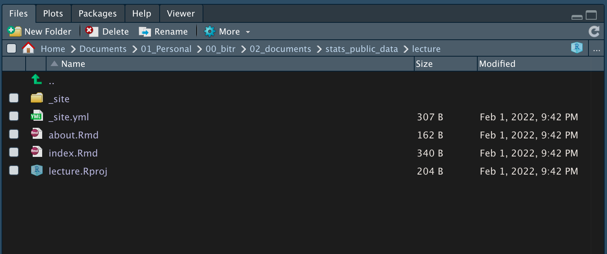

```{r setup, include=FALSE}
knitr::opts_chunk$set(echo = TRUE, 
                      message = FALSE, 
                      warning = FALSE, 
                      collapse = FALSE,
                      fig.align = "center")
library(shiny)
library(htmltools)

xaringanExtra::use_panelset()
```


```{r tidyverse, echo=FALSE, out.width = "20%"}
knitr::include_graphics("img/distill_logo.png")
```

```{r, preface, echo=FALSE}
div(class = "preface", 
    h4("들어가기"),
    "distill은 과학 및 기술문서를 작성하기 위한 R Markdown 포맷입니다.", br(),
    "R Markdown은 재현가능한 연구나 개인과 조직의 Knowledge Base 구축을 위해 유용하게 사용됩니다.", br(),
    "이제 여러분은 R Markdownd 기반의 distill으로 여러분의 저술 활동에 날개를 달게 됩니다.")
```


## 들어가기

재현가능한 연구(Reproducible Research)라는 용어가 생소할 수 있으나 R world에서는 제법 회자되는 용어입니다. 공개한 연구의 결과물이 재현되고 검증될 수 있도록 하는 것을 의미합니다. 이 방법은 결국 연구가 발전하는 방향으로 재창조되는 결실을 가져옵니다. 이를 위해서는 데이터 분석의 방법을 실험 데이터에 연결하여 재현 검증될 수 있는 체계를 구축해야 합니다.

재현가능한 연구를 이해하기 쉬운 사례로 설명하겠습니다. 데이터 입출력 및 분석 방법의 로직과 분석 결과를 표현하는 R 스크립트를 R 마크다운 문서에 정리합니다. 물론 연구에 대한 자세한 설명과 결과 해석이 문서에 포함되어 있고, 원시 데이터도 별도로 포함합니다. 이 연구 결과를 RStudio 프로젝트나 R 패키지로 배포하면 누구나 동일한 결과를 재현할 수 있게 됩니다.

공개한 연구 자료에는 데이터, 분석을 위한 R 코드 및 과정의 설명과 결과의 해석 모두 포함되어야 합니다. 그러므로 재현가능한 연구는 오픈소스 정신이 깃들여 있는 셈입니다.

[CRAN Task View: Reproducible Research](https://cran.r-project.org/web/views/ReproducibleResearch.html){target="_blank"} 페이지를 보면 R에서 재현가능한 연구를 지원하는 에코 시스템이 어마어마하게 많고 다양한 기능을 가지고 있음에 놀랄 것입니다. 다수의 R 패키지가 여러 기능을 통해서 재현가능한 연구를 지원합니다만, R 마크다운 문서가 정적이거나 동적인 HTML 문서의 보고서로 만들어지거나 혹은 LaTeX을 이용해서 PDF 문서로 만들어지는 것이 눈에 잡히는 재현가능한 연구의 도구입니다.

광의적으로는 rmarkdown, knitr, blogdown, bookdown, distill도 재현가능한 연구를 지원하는 패키지입니다.


## distill

distill 홈페이지인 [https://rstudio.github.io/distill/](https://rstudio.github.io/distill/){target="_blank} [@allaire2018distill]를 방문하면, distill의 기능을 익힐 수 있습니다. 헥스로고는 다음과 같이 물방울 이미지를 포함하고 있습니다.


다음에 distill의 재현가능한 연구에 최적화된 대표적인 기능을 정리해 봅니다.

* Refrences의 표시
  - 페이지 하단에 참조물을 표현합니다.
  - Bibtex, YAML format의 bibliography을 지원합니다.
* Citation의 표시
  - 페이지 하단에 Citation을 표현합니다.
  - 페이지 YAML 헤더를 읽어 Citation을 만들어줍니다.
  
이 포스트는 기술적인 노하우나 경험을 담고 있지는 않지만, 이해의 측면에서 distill의 재현가능한 연구에 최적화된 대표적인 기능을 표현해 보았습니다.


## R 마크다운 문서의 이해
### 웹 사이트 만들기

distill 패키지의 create_website() 함수로 웹 사이트의 골격(skeleton) 만듧니다.

* 디렉토리 경로는 "./workshop_lecture"
* 웹사이트의 타이틀은 "애플리케이션 서버 구축을 위한 R 워크샾"

다음 스크립트로 웹 사이트 구축을 위한 골격을 만듧니다.

```{r, eval=FALSE}
distill::create_website(
  dir = "./workshop_lecture", 
  title = "애플리케이션 서버 구축을 위한 R 워크샾"
)
```

### Template 파일의 이해

create_website() 함수를 실행하면 다음처럼 몇 개의 파일과 디렉토리가 만들어집니다.

```{r templates, echo=FALSE, out.width = "85%"}

```

<br>

대표적인 파일의 내용은 다음과 같습니다. 이제 여러분은 이 파일을 기초로 해서, 기능을 확장하고 내용을 채워나가야 합니다.


::: {.panelset}


::: {.panel}
#### \_site.yml {.panel-name}

````
name: "workshop_lecture"
title: "애플리케이션 서버 구축을 위한 R 워크샾"
description: |
  애플리케이션 서버 구축을 위한 R 워크샾
output_dir: "_site"
navbar:
  right:
    - text: "Home"
      href: index.html
    - text: "About"
      href: about.html
output: distill::distill_article

````
:::


::: {.panel}
#### index.Rmd {.panel-name}

````
---
title: "애플리케이션 서버 구축을 위한 R 워크샾"
description: |
  Welcome to the website. I hope you enjoy it!
site: distill::distill_website
---

```{r setup, include=FALSE}`r ''`
knitr::opts_chunk$set(echo = FALSE)

# Learn more about creating websites with Distill at:
# https://rstudio.github.io/distill/website.html

```
````
:::


::: {.panel}
#### abount.Rmd {.panel-name}

````
---
title: "About this site"
description: |
  Some additional details about the website
---

```{r setup, include=FALSE}`r ''`
knitr::opts_chunk$set(echo = FALSE)
```
````
:::


:::

## 설정 최적화하기
기본 템플리트를 사용자 환경에 최적화하는 몇 가지 방법을 다룹니다.

### 웹 페이지 출력 경로의 변경
무료로 정적 웹 페이지를 온라인에 배포하는 대표적인 두 가지 방법이 있습니다.

* [netlify](https://www.netlify.com/){target="_blank"}
* [github](https://github.com/){target="_blank"}

두 서비스는 각각 서로 다른 웹 페이지 출력 경로의 이름을 사용합니다.

**netlify**는 **\_site**를 사용하고, **github**는 **docs**를 사용합니다.

distill은 기본 netlify에 서비스를 배포하는 것을 염두에 두고 "\_site"를 웹 페이지 출력 경로로 사용합니다. 그러므로 github에 배포하기 위해서는 다음처럼 \_site.yml 파일에서 **output_dir**을 수정합니다.


::: {.panelset}

::: {.panel}
#### netlify {.panel-name}

````
name: "workshop_lecture"
title: "애플리케이션 서버 구축을 위한 R 워크샾"
description: |
  애플리케이션 서버 구축을 위한 R 워크샾
output_dir: "_site"
navbar:
  right:
    - text: "Home"
      href: index.html
    - text: "About"
      href: about.html
output: distill::distill_article

````
:::


::: {.panel}
#### github {.panel-name}

````
name: "workshop_lecture"
title: "애플리케이션 서버 구축을 위한 R 워크샾"
description: |
  애플리케이션 서버 구축을 위한 R 워크샾
output_dir: "docs"
navbar:
  right:
    - text: "Home"
      href: index.html
    - text: "About"
      href: about.html
output: distill::distill_article

````
:::

:::

### 테마 변경하기

웹 페이지의 테마(theme)를 변경할 수 있습니다. 본 웹 페이지는 테마를 위한 CSS[^1] 파일로 **theme.css** 를 만들었습니다.

[^1]: 캐스케이딩 스타일 시트(Cascading Style Sheets, CSS)는 마크업 언어가 실제 표시되는 방법을 기술하는 스타일 언어(style sheet language)이다. [https://ko.wikipedia.org/wiki/CSS](https://ko.wikipedia.org/wiki/CSS){target="_blank"}

이 파일을 적용하기 위해서는 R Markdown 파일인 \_site.yml를 변경해야 합니다.

YAML 헤더는 [YAML 이해하기](https://choonghyunryu.github.io/BitStat_Help_Handson/rmarkdown_yaml.html){target="_blank"}를 참고하세요.


### footer 적용하기
footer는 웹 페이지에 공통적으로 적용되는 페이지 하단의 컨텐츠입니다.

footer를 **footer.html** HTML 파일로 만들어서 \_site.yml에 설정합니다.

### bibliography 적용하기

Reference를 정의하기 위한 bibliography는 **biblio.bib** 파일에 정의하고  *.Rmd의 YAML 헤더에 설정합니다.

### 이 페이지의 YAML 헤더

이 페이지의 YAML 헤더는 다음과 같습니다.

````
---
title: "distill 패키지의 활용"
description: |
  distill 패키지를 사용해서 Knowledge Base 구축을 위한 홈페이지를 만듭니다. 
site: distill::distill_website
output:
  distill::distill_article:
    toc: true
    toc_depth: 3  
    theme: theme.css
    includes:
      after_body: footer.html    
author:
  - name: 유충현 
    url: https://choonghyunryu.github.io/
    affiliation: 한화생명
bibliography: biblio.bib    
date: 2022-02-01     
---
````

## R Markdown의 이해
R Markdown을 이해하기 위해서 [R Markdown의 이해](https://choonghyunryu.github.io/BitStat_Help_Handson/rmarkdown.html){target="_blank"}를 학습하기 바랍니다.


