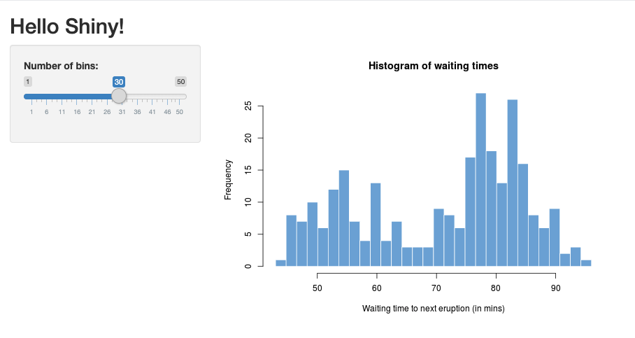
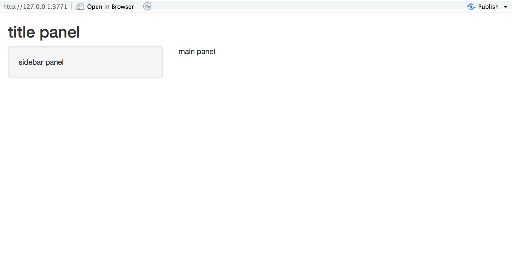
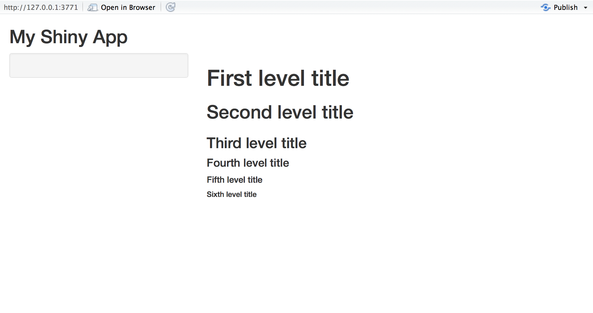

```{r setup, include=FALSE}
knitr::opts_chunk$set(echo = FALSE, 
                      message = FALSE, 
                      warning = FALSE, 
                      collapse = FALSE,
                      fig.align = "center")

library(shiny)
library(htmltools)
```

```{r user-interface, echo=FALSE, out.width = "40%"}

```

```{r, preface}
div(class = "preface", 
    h3("들어가기"),
    "사용자 인터페이스는", strong("사용자와 컴퓨터를 연결해주는 메신저입니다."), "사용자의 의도를 Shiny에게 전달하는", strong("의도 파악"), "과 R의 수행결과를 Shiny를 통해", strong("내용의 전달"), "을 도와줍니다.", br(),
    "사용자 인터페이스를 이해하는 것은 훌륭한 메신저가 되기 위한 여정입니다. 자, 얼른 일어나세요.",
    style = "margin-bottom: 40px;")
```

# Shiny 사용자 인터페이스
     
## Shiny 앱 Skeleton

```{r, eval=FALSE, echo=TRUE}
library(shiny)

# Define UI ----
ui <- fluidPage(
  
)

# Define server logic ----
server <- function(input, output) {
  
}

# Run the app ----
shinyApp(ui = ui, server = server)
```


## 페이지
**Shiny 앱의 UI는 하나의 Page로 구성**됩니다. 즉, 페이지(page)에 여러 개의 위젯을 배치하여 앱을 구성합니다. 이 Skeleton에서는 fluidPage를 사용하였군요.

> 페이지는 화가가 그림을 그릴 캔버스라고 이해하면 쉽습니다. 화가가 캔버스에 여러 가지 과일과 꽃 등을 배치하여 정물화를 그리거나, 나무, 산, 강 등을 적절하게 배치하여 풍경화를 그리는 것처럼 Shiny는 페이지에 위젯을 적절하게 배치하여 앱을 개발하는 것입니다.


### shiny 페이지
다음 이미지는 앞에서 실행해 보았던 예제에서 fluidPage로 정의한 UI입니다. 



그리고 shiny 패키지는 다음과 같은 몇 개의 페이지 함수를 포함하고 있습니다.

```{r, echo=TRUE}
library(magrittr)
library(shiny)

ls(pos = "package:shiny", pattern = "Page$") %>% 
  setdiff(
    ls(pos = "package:shiny", pattern = "^update")
  )
```

>유화를 그리는 화가는 캔버스를 준비하지만, 산수화를 그리는 화가는 화선지를 준비하고, 초등학교 미술시간에는 크레파스와 켄트지를 준비하겠지요. 용도에 따라 몇 개의 페이지를 준비해 놓은 것입니다.

### shinydashboard 페이지
다음은 shiny로 대시보드를 구현할 때 사용하는 shinydashboard 패키지의 dashboardPage로 정의한 UI입니다. 


shinydashboard 패키지는 dashboardPage라는 단 하나의 페이지만 제공합니다.

```{r, echo=TRUE}
library(shinydashboard)

ls(pos = "package:shinydashboard", pattern = "Page$")
```

현재 BitStat는 shinydashboard 패키지를 확장한 shinydashboardPlus 패키지의 dashboardPage로 페이지를 구성하고 있습니다.


## 레이아웃과 패널
페이지에 위젯을 보기 좋게 배치하기 위해서 Shiny는 레이아웃(layout)과 패널(panel)을 제공합니다.
레이아웃은 페이지를 가상으로 구획하는 구도이며, 패널은 위젯을 그룹핑하여 패치할 공간을 의미합니다.

> 화가는 캔버스를 가상으로 나누는 구도를 잡고 사물을 그리는 것처럼 Shiny는 레이아웃으로 구도를 잡고, 패널을 적당하게 배치한 후 패널 안에 비로소 위젯을 채워나갑니다. 즉, 레이아웃과 패널을 적당히 섞어서 앱의 모양(UI)을 정의합니다.


### 레이아웃

shiny 패키지는 몇 개의 레이아웃을 제공하는데 앞의 예제처럼 sidebarLayout이 일반적으로 사용됩니다.

```{r, echo=TRUE}
ls(pos = "package:shiny", pattern = "Layout$") 
```


### 패널

shiny 패키지는 몇 개의 패널을 제공하는데 앞의 예제에서는 titlePanel, sidebarPanel, mainPanel이 사용되었습니다.

```{r, echo=TRUE}
ls(pos = "package:shiny", pattern = "Panel$") %>% 
  setdiff(
    ls(pos = "package:shiny", pattern = "^update")
  )
```

### 레이아웃과 패널의 배치 예제

다음 예제는 히스토그램을 그리는 예제에서의  레이아웃과 패널의 배치 방법입니다. 위젯을 포함하지 않은 상태입니다.

```{r, echo=TRUE, eval=FALSE}
ui <- fluidPage(
  titlePanel("title panel"),

  sidebarLayout(
    sidebarPanel("sidebar panel"),
    mainPanel("main panel")
  )
)
```

위와 같은 배치는 다음 그림과 같은 사이드 바 구도를 만들어 줍니다.



sidebarLayout은 일반적으로 sidebarPanel와 mainPanel을 포함합니다. 이것은 **왼쪽에 사이드 바 패널**을 만들어서 사용자의 입력을 받는 위젯을 배치하고 **오른쪽에는 사용자의 입력에 따른 결과를 출력할 메인 패널**을 배치하는 방법으로 동작합니다.   
titlePanel은 이름처럼 앱의 타이틀을 출력할 패널입니다.

## HTML 태그
아시다시피 Shiny 앱을 HTML로 동작하는 웹 어플리케이션을 의미합니다. 즉, Shiny가 만들어 주는 것은 웹 어플리케이션을 구성하는 HTML, CSS, Javascript입니다.

R의 htmltools 패키지는 HTML 태그를 만들어 주는 패키지입니다. shiny 패키지가 htmltools 패키지를 이용해서 HTML 태그를 만들어 줍니다.

### HTML 태그를 만드는 함수

h1() 함수는 첫번째 레벨의 해더를 생성하는 MTML의 \<h1\> 태그를 만들어 줍니다. 글쓰기에서 장(Chapter)의 타이틀을 만들 때 사용하는 태그입니다. 헤더(Headers)를 만들어 준다고 이해하면 쉽겠지요. 이니셜을 따서 h, 첫번 째라서 1가 됩니다. 합치면 h1가 되겠지요. 숫자가 클수록 글자의 크기가 작아집니다.

h1() 함수는 다음처럼 \<h1\> 태그를 만들어 줍니다.

```{r, echo=TRUE, eval=FALSE}
h1("A first level header")
[1] <h1>A first level header</h1>
```

<br>
그런데, 이 HTML 태그는 웹 브라우저에서 다음과 같이 출력됩니다.

```{r, results='asis'}
h1("A first level header", style = "color: black !important;")
```

shiny 패키지에서 제공하는 대표적인 HTML 태그 함수는 다음과 같습니다.

+------------+--------------+---------------------------+
| 함수       | HTML 태그    | 의미                      | 
+:===========+:=============+:==========================+
| p          | \<p\>        | 파라그래프 텍스트         | 
+------------+--------------+---------------------------+
| h1         | \<h1\>       | 첫번째 헤더               | 
+------------+--------------+---------------------------+
| h2         | \<h2\>       | 두번째 헤더               | 
+------------+--------------+---------------------------+
| h3         | \<h3\>       | 세번째 헤더               | 
+------------+--------------+---------------------------+
| h4         | \<h4\>       | 네번째 헤더               | 
+------------+--------------+---------------------------+
| h5         | \<h5\>       | 다섯번째 헤더             | 
+------------+--------------+---------------------------+
| h6         | \<h6\>       | 여섯번째 헤더             | 
+------------+--------------+---------------------------+
| br         | \<br\>       | 줄 바꿈                   | 
+------------+--------------+---------------------------+
| hr         | \<hr\>       | 수평선 긋기               | 
+------------+--------------+---------------------------+
| img        | \      | 이미지 삽입               | 
+------------+--------------+---------------------------+
| strong     | \<strong\>   | 볼드체                    | 
+------------+--------------+---------------------------+
| div        | \<div\>      | 동일 스타일의 문자 디비젼 | 
+------------+--------------+---------------------------+
| span       | \<span\>     | 동일 스타일의 문자 인라인 | 
+------------+--------------+---------------------------+    

### HTML 태그를 사용 예제

다음 예제는 여러 종류의 헤더를 출력하는 UI의 설계입니다. 입력 위젯은 포함하지 않은 상태입니다.

```{r, echo=TRUE, eval=FALSE}
ui <- fluidPage(
  titlePanel("My Shiny App"),
  sidebarLayout(
    sidebarPanel(),
    mainPanel(
      h1("First level title"),
      h2("Second level title"),
      h3("Third level title"),
      h4("Fourth level title"),
      h5("Fifth level title"),
      h6("Sixth level title")
    )
  )
)
```

위와 같은 배치는 다음 그림과 같은 사이드 바 구도를 만들어 줍니다.




# tutorial
tutorial에서는 UI 뼈대를 만들기 위해서 fluidPage, sidebarLayout, mainPanel, tabsetPanel을 사용합니다. 
     
## UI 뼈대 만들기 tutorial

다음 코드를 입력한 후, app.R이라는 이름의 파일로 저장하고 실행해 보세요. 앞에서 다룬 **사이드바 레이아웃** 그림과 같은 앱이 출력됩니다. 

```{r, eval=FALSE, echo=TRUE}
library(shiny)

# Define UI ----
ui <- fluidPage(
  titlePanel("title panel"),
  
  sidebarLayout(position = "right",
                sidebarPanel("sidebar panel"),
                mainPanel("main panel")
  )
)

# Define server logic ----
server <- function(input, output) {
  
}

# Run the app ----
shinyApp(ui = ui, server = server)
```

## Shiny 공식 tutorial 페이지

Shiny 공식 tutorial 페이지를 살펴보고, 사용자 인터페이스를 구축하는 방법을 이해하세요.

[https://shiny.rstudio.com/tutorial/written-tutorial/lesson2/](https://shiny.rstudio.com/tutorial/written-tutorial/lesson2/){target="_blank"} 


## 추가 예제 실행해 보기

예제를 실행시켜 보고, tabsetPanel의 기능을 이해하세요. tabsetPanel은 탭 기능으로 여러 출력 위젯을 선택적으로 한 화면에 표현해 줍니다.

```{r, eval=FALSE, echo=TRUE}
shiny::runExample("06_tabsets")
```


